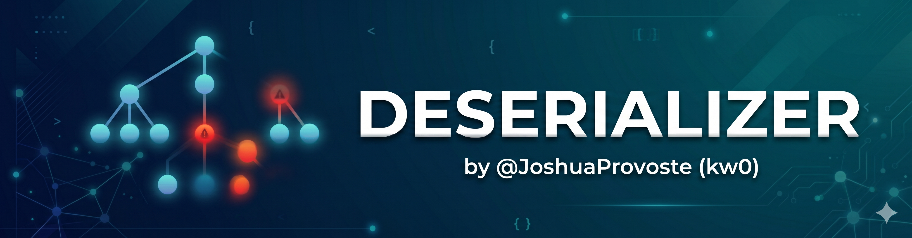

# Deserializer (AST-based Static Code Analyzer with Agentic LLM-Powered Relationship Mapping)



**Deserializer** is an advanced Abstract Syntax Tree (AST) static analysis engine designed to identify insecure object reconstruction and state persistence sinks across the Python ecosystem, **with strong focus on AI, LLM, Robotics, Data Science, Machine Learning and Deep Learning fields** (but not limited).

Far beyond a traditional scanner, it provides a generic, high-performance framework for auditing over 120 libraries and formats—including YAML, Msgpack, CBOR, and custom JSON hooks—where traditional trust in "safe" serialization hides critical logic-based RCE vectors like *Type Smuggling*. By resolving imports, aliases, and complex dotted attributes, the tool serves as a high-fidelity signal amplifier that prioritizes dangerous code paths in modern distributed architectures and AI/ML repositories.

The project operates through a modular, multi-phased workflow that transitions from raw detection to deep technical audit. **Following the initial high-velocity SAST scan, the ecosystem leverages specialized relationship mappers to trace execution flows and result processors to generate detailed security reports. This systematic approach ensures that every finding is contextualized within the application's broader architecture, transforming high-volume telemetry into actionable research assets and structured milestones that simplify the mapping of infrastructure-level attack surfaces**.

At its most advanced tier, **Deserializer integrates an autonomous AI Security Agent** (Phase 4), explicitly designed to navigate "self-command-injection" limitations and synthesize functional reproduction guides. This capability has directly powered the discovery of critical vulnerabilities in industry-leading frameworks like TensorFlow, Django, and LangGraph, proving its efficacy in auditing complex MLOps and agentic AI environments. As the project evolves, it continues to define the frontier of automated vulnerability research by bridging the gap between static analysis and functional exploit development.

## Research writeups supported by Deserializer (AI, Robotics, Data Science, Machine Learning and Deep Learning)

**Deserializer** directly supports security research by locating RCE and Insecure Deserialization paths across various large-scale AI, Robotics, and Data Science projects and environments.

1. **Genesis World (v0.2.1) - Cache Infrastructure**:
    - **Impact**: Critical RCE on robotics research workstations and automated physics simulation pipelines.
    - **RCE PoC**: [RCE in genesis-world v0.2.1](research/genesis-world_v0.4.6_RCE_via_Global_Cache_Poisoning_based_on_Predictable_Asset_Hashing/README.md)
    - **Disclosure**: https://hackedalert.com/research/genesis-world-v0-4-6-rce-global-cache-poisoning/

2. **MuJoCo (v3.7.0) - TimeSeries**:
    - **Impact**: Critical RCE on robotics research workstations and automated simulation pipelines.
    - **RCE PoC**: [RCE in MuJoCo v3.7.0 (UNC Redirection)](research/mujoco_v3.7.0_RCE_via_UNC_Path_Redirection/README.md)
    - **Disclosure**: https://hackedalert.com/research/mujoco-v3-7-0-rce-via-unc-path-redirection/

3. **MuJoCo (v3.7.0) - SystemTrajectory**:
    - **Impact**: Critical RCE on collaborative robotics platforms and benchmarking workstations.
    - **RCE PoC**: [RCE in MuJoCo v3.7.0 (Supply Chain)](research/mujoco_v3.7.0_Supply_Chain_Compromise_via_SystemTrajectory/README.md)
    - **Disclosure**: https://hackedalert.com/research/mujoco-v3-7-0-supply-chain-compromise-systemtrajectory/

4. **LeRobot (v0.5.1) - PolicyServer**:
    - **Impact**: Critical RCE on robotics research infrastructure and inference servers.
    - **RCE PoC**: [RCE in lerobot v0.5.1 (PolicyServer)](research/lerobot_v0.5.1_Unauthenticated_RCE_in_PolicyServer/README.md)
    - **Disclosure**: https://hackedalert.com/research/lerobot-v0-5-1-unauthenticated-rce-policy-server/

5. **LeRobot (v0.5.1) - LearnerService**:
    - **Impact**: Critical RCE on GPU-based training clusters and distributed RL infrastructure.
    - **RCE PoC**: [RCE in lerobot v0.5.1 (LearnerService)](research/lerobot_v0.5.1_Unauthenticated_RCE_in_LearnerService/README.md)
    - **Disclosure**: https://hackedalert.com/research/lerobot-v0-5-1-unauthenticated-rce-learner-service/

6. **Brax (v0.14.2)**:
    - **Impact**: Critical RCE on compute nodes and TPU/GPU pods.
    - **RCE PoC**: [RCE in brax v0.14.2](research/brax_v0.14.2_RCE_based_on_PKL_File_Deserialization/README.md)
    - **Disclosure**: https://hackedalert.com/research/brax-v0-14-2-rce-insecure-deserialization/

7. **TensorFlow (v2.21.0)**:
    - **Impact**: Critical RCE on developer workstations and MLOps infrastructure.
    - **RCE PoC**: [RCE in tensorflow v2.21.0](research/tensorflow_v2.21.0/README.md)
    - **Disclosure**: https://hackedalert.com/research/tensorflow-v2-21-0-rce-insecure-deserialization/

8. **LangGraph (v1.1.6)**:
    - **Impact**: Critical RCE on agentic AI infrastructure and GPU/TPU clusters.
    - **RCE PoC**: [RCE in langgraph v1.1.6](research/langgraph%20_v1.1.6/README.md)
    - **Disckosure**: https://hackedalert.com/research/langgraph-v1-1-6-rce-insecure-deserialization-bypass/

9. **VibeVoice (v0.0.1)**:
    - **Impact**: Critical RCE on developer workstations and AI-as-a-Service (AIaaS) platforms.
    - **RCE PoC**: [RCE in vibevoice v0.0.1](research/vibevoice_v0.0.1/README.md)
    - **Disclosure**: https://hackedalert.com/research/vibevoice-v0-0-1-rce-insecure-deserialization/

10. **Hugging Face Hub (v1.11.0)**:
    - **Impact**: Critical RCE on Data Science workstations and Automated ML Training Pipelines.
    - **RCE PoC**: [RCE in huggingface-hub v1.11.0](research/huggingface-hub_v1.11.0_Hub-to-RCE_via_from_pretrained_fastai/README.md)
    - **Disclosure**: https://hackedalert.com/research/huggingface-hub-v1-11-0-hub-to-rce-via-from-pretrained-fastai/

11. **Hugging Face Hub (v1.11.0)**:
    - **Impact**: Critical RCE on Windows-based AI/ML development pipelines and DevOps automation.
    - **RCE PoC**: [RCE in huggingface-hub v1.11.0 (Supply Chain)](research/huggingface-hub_v1.11.0_Supply_Chain_RCE_via_load_torch_model_Defaults/README.md)
    - **Disclosure**: https://hackedalert.com/research/huggingface-hub-v1-11-0-supply-chain-rce-via-load-torch-model-defaults/

12. **PyGlove (v0.4.5)**:
    - **Impact**: Critical RCE via JSON APIs and distributed tuning.
    - **RCE PoC**: [RCE in pyglove v0.4.5](research/pyglove_v0.4.5/README.md)
    - **Disclosure**: https://hackedalert.com/research/pyglove-v0-4-5-rce-insecure-deserialization/

13. **Learned Optimization (v0.0.1)**:
    - **Impact**: Critical RCE in HPC research environments and TPU/GPU pods.
    - **RCE PoC**: [RCE in learned_optimization v0.0.1](research/learned_optimization_v0.0.1/README.md)
    - **Disclosure**: https://hackedalert.com/research/learned-optimization-v0-0-1-rce-insecure-deserialization/

14. **Vertex AI (v1.147.0)**:
    - **Impact**: Critical RCE on developer workstations, CI/CD runners (MLOps), and research environments.
    - **RCE PoC**: [RCE in google-cloud-aiplatform v1.147.0](research/google_cloud_aiplatform_v1.147.0/README.md)
    - **Disclosure**: https://hackedalert.com/research/google-cloud-aiplatform-v1-147-0/

15. **Agent Development Kit (ADK) (v1.30.0)**:
    - **Impact**: Critical RCE on developer workstations and AI infrastructure during session management.
    - **RCE PoC**: [RCE in google-adk v1.30.0](research/google_adk_v1.30.0/README.md)
    - **Disclosure**: https://hackedalert.com/research/google-adk-v1-30-0-rce-insecure-deserialization/

16. **Dopamine (v2.0)**:
    - **Impact**: Critical RCE in distributed research clusters.
    - **RCE PoC**: [RCE in dopamine v2.0](research/dopamine_v2.0/README.md)
    - **Disclosure**: https://hackedalert.com/research/dopamine-v2-0-rce-insecure-deserialization/

17. **Django (v6.0.4)**:
    - **Impact**: Critical RCE via cache poisoning (Redis/Memcached) or SMB/UNC path redirection.
    - **RCE PoC**: [RCE in django v6.0.4](research/django_v6.0.4/README.md)
    - **Disclosure**: https://hackedalert.com/research/django-v6-0-4-rce-insecure-deserialization/

## The Deserializer Ecosystem: 4 Pillars of Audit

The project is structured into four distinct phases, each designed to shift the analysis from high-volume automated telemetry to deep, functional security research:

| Phase | Title | Tooling / Engine | Objective |
| :--- | :--- | :--- | :--- |
| **1** | **High-Velocity Detection** | `deserializer.py` (Triple-Pass) | Perform massive-scale SAST to identify potential deserialization sinks. |
| **2** | **Relationship Mapping** | Result Processors / Mappers | Contextualize findings by tracing execution flows and component interdependencies. |
| **3** | **Technical Synthesis** | Research Documentation | Formalize findings into technical writeups, mapping infrastructure-level attack surfaces. |
| **4** | **Autonomous AI Audit** | AI Security Agent (MiniMax-M2.5) | Automate 0-day discovery and generate functional reproduction guides/exploits. |

## Project Structure

A high-level map of the repository's organization and the technical purpose of each specialized directory:

-   **`agent/`**  
    Implementation of the Phase 4 AI Security Agent, including orchestration logic for deep analysis, reproduction guide synthesis, and LLM interaction.
-   **`docs/`**  
    Central repository for project documentation, architectural diagrams, branding assets, and supporting high-level technical materials.
-   **`exploit_development/`**  
    Dedicated space for engineering functional exploits, researching deserialization primitives (hooks/methods), and documenting cross-platform orchestration techniques.
-   **`modules/`**  
    Core logic components, auxiliary utility functions, and scanner extensions that power the detection and relationship mapping phases of the toolchain.
-   **`reports/`**  
    Storage for structured security analysis outputs, telemetry, and audit results generated by the scanner during multi-phased project evaluations.
-   **`research/`**  
    A collection of high-fidelity vulnerability writeups, validated Proof-of-Concept (PoC) scripts, and deep audits conducted on modern AI/ML frameworks.
-   **`templates/`**  
    Standardized reporting and research templates used to maintain technical consistency across vulnerability writeups and correlation reports.

## Dependencies & Portability

This scanner integrates high-fidelity **AI-Driven Deep Analysis (Phase 4)** as an optional module. Consequently, the project **requires** the installation of external dependencies for AI orchestration, environment management, and inference only when the `--agent` flag is used.

**Installation**:
Before running the scanner, you MUST install the dependencies:
```bash
pip install -r requirements.txt
```

### AI-Driven Deep Analysis (Phase 4)

This phase integrates a specialized AI Security Agent to perform deep code reviews and map complex 0-day RCE vectors. Using the **MiniMax-M2.5** model (via Hugging Face), the agent analyzes findings to reverse "self-command-injection" contexts and generate technical reproduction guides with a multi-platform focus (e.g., Attacker UNIX/Raspberry vs Victim Windows). **Note: This phase is only executed if the `--agent` flag is provided.**

**Setup Requirements**:
- **Environment**: Create a `.env` file in the root directory and add your Hugging Face token:
  ```env
  HF_TOKEN=your_token_here
  ```

## Performance & Multiprocessing

This scanner features a high-performance **parallel execution engine** built on Python's `concurrent.futures.ProcessPoolExecutor`. It is designed to scale across all available CPU cores (controllable via the `-j` or `--concurrency` flag), making it capable of scanning tens of thousands of files in seconds.

- **Non-Blocking UI**: Features a stable, docked progress bar with a one-line gap for clean results presentation.
- **Native Signal Handling**: On Windows, it utilizes a native `SetConsoleCtrlHandler` via `ctypes` to ensure that `Ctrl+C` is 100% responsive, even during heavy processing.
- **Silent Tracebacks**: Worker processes are silented to ensure that interrupts and internal errors don't clutter the technical output.
- **Native Windows UI Support**: Automatically enables Virtual Terminal Processing via `ctypes` for native ANSI color support in modern CMD and PowerShell environments.

> [!WARNING]
> **Performance Warning**: When analyzing extremely large or complex files (e.g., over 1MB, 2MB, or 3MB in size), the tool may experience significant slowdowns or appear "stuck" while parsing deep AST trees. If you encounter such bottlenecks, consider using the `--timeout` (to skip slow files) and `--max-size` (to skip huge files) flags to maintain scan velocity.

## What it does

- **Triple-Pass Scanning Engine**: Implements an "unbreakable" multi-tiered approach:
  - **Pass 1 (AST)**: High-fidelity grammatical decomposition for precise analysis.
  - **Pass 2 (Token Fallback)**: Automated fallback to a stream-based tokenizer when encountering syntax errors or unparsable sections.
  - **Pass 3 (Regex Emergency)**: A final pattern-matching layer ensuring coverage in extremely hostile or fragmented source files.
- **Native Template Neutralization**: Built-in support for sanitizing Jinja2 and Mako tags, allowing the scanner to process web templates and code-generation files without choking on non-Python syntax.
- **Call & Reference Detection**: Identifies not just direct execution sinks (e.g., `pickle.loads()`) but also **dangerous function references** (e.g., `func = pickle.load`), tracking assignments across the local namespace.
- Tracks imports/aliases to resolve calls like:
  - `import pickle as p` → `p.loads(...)`
  - `import torch as t` → `t.load(...)`
  - Deep attributes like `pkg.pickle.loads(...)` or `torch.serialization.load(...)`
- Emits findings as **JSONL**, one object per line, including:
  - file path + location (`lineno`, `col_offset`)
  - `module`, `name`, `qualified_name`
  - `category` and `severity` (extra fields, backwards-compatible)
  - `parser`: Metadata indicating which engine pass made the discovery (`ast`, `tokenize_fallback`, or `regex_fallback`).
- Guards against pathological inputs with:
  - max file size (`MAX_FILE_BYTES`)
  - max visited AST nodes (`MAX_AST_NODES`)
- Optional: loads a custom ruleset from `rules.json` and warns on malformed entries/typos.

## Installation

No dependencies.

```bash
python --version
# Python 3.9+ recommended
```

## Usage

Recommended usage:

### Without AI Agent
```bash
python deserializer.py --path cloned-repo --rules-file rules.json -j 4 --out cloned-repo/cloned-repo.jsonl
```

### With AI Agent
```bash
python deserializer.py --path cloned-repo --rules-file rules.json -j 4 --out cloned-repo/cloned-repo.jsonl --agent
```

### 1. Basic Scan
Scan the current directory and print findings to the terminal (writes JSONL to stdout by default):
```bash
python deserializer.py
```

### 2. Targeted Audit
Scan a specific repository and save findings to a JSONL file:
```bash
python deserializer.py --path /path/to/my-repo --out audit_results.jsonl
```

### 3. Turbo Mode (Performance Tuning)
Use 8 concurrent processes and a 5-second timeout per file to keep the scan moving:
```bash
python deserializer.py -j 8 --timeout 5 --out findings.jsonl
```

### 4. CI/CD & Pipeline Integration
Disable the banner and stream JSONL directly to stdout for pipe processing (human logs will go to stderr):
```bash
python deserializer.py --no-banner --out - | jq .
```

### 5. Hardened / Safety Scan
Limit processing to files under 1MB and skip specific data directories:
```bash
python deserializer.py --max-size 1048576 --skip-dirs "data,samples,tests"
```

### 6. Custom Detection Rules
Use a proprietary ruleset to detect logic-specific calls:
```bash
python deserializer.py --rules-file my_custom_rules.json --out legacy_audit.jsonl
```

### 7. AI Deep Analysis
Trigger the AI-Driven Deep Analysis (Phase 4) after the scan and mapping are complete:
```bash
python deserializer.py --path /path/to/repo --out findings.jsonl --agent
```

## CLI Flags

- `--path <dir>`  
  Root directory to scan. Default: `.`

- `--rules-file <path>`  
  Path to a JSON ruleset. If provided, it overrides the built-in `DEFAULT_RULES`.

- `--out <path|->`  
  Output destination for JSONL results. Use `-` to write JSONL to `stdout`. Default: `-`

- `-j, --concurrency <int>`  
  Number of concurrent processes to use. Default: `(CPU cores - 2)`.

- `-t, --timeout <float>`  
  Timeout in seconds for each file analysis. Only effective in parallel mode. Default: `None` (no timeout).

- `--max-size <bytes>`  
  Maximum file size in bytes to process. Default: `10,485,760` (10 MiB).

- `--skip-dirs <list>`  
  Comma-separated list of directory names to ignore (e.g., `tests,.git,env`).

- `--no-banner`  
  Disable the ASCII branding banner for cleaner output in scripts.

- `--agent`  
  Run AI-driven deep analysis (Phase 4). This phase is optional and requires a valid `HF_TOKEN` in the `.env` file.

## Output format (JSONL)

Each line is a standalone JSON object. Example finding:

```json
{
  "file": "some/path/module.py",
  "kind": "call",
  "module": "pickle",
  "name": "loads",
  "qualified_name": "pickle.loads",
  "category": "deserialize",
  "severity": "high",
  "lineno": 34,
  "col_offset": 11
}
```

Errors (parse/read/stat/limits) are also emitted as JSONL objects:

```json
{ "file": "bad.py", "error": "syntax_error:..." }
```

Exit code:
- `0` if no errors occurred during scanning
- `1` if any IO/parse/limit errors occurred (useful for CI)

## Rules file format (`rules.json`)

Rules are a JSON object keyed by a logical module name, with:
- `imports`: list of import roots to track
- `calls`: list of `[module, function]` pairs

Example:

```json
{
  "pickle": {
    "imports": ["pickle"],
    "calls": [["pickle","load"], ["pickle","loads"]]
  },
  "torch": {
    "imports": ["torch"],
    "calls": [["torch","load"]]
  }
}
```

The loader normalizes imports (keeps the root token) and includes a **Heuristic Typo Detector** that prints warnings to stderr if rule definitions contain near-matches to tracked modules (e.g., alerting on `picle` vs `pickle`).

## Notes on interpretation

This tool is a **signal amplifier**, not a verdict generator. A `pickle.load(s)` finding is often high-risk, but real exploitability depends on whether an attacker can influence the loaded artifact (local file, downloaded model, CI artifact, bucket object, etc.) and on any integrity/provenance controls in the pipeline.

### License

Copyright (c) 2026 Joshua Provoste. All rights reserved.
No license is granted to use, copy, modify, or distribute this software without explicit permission.