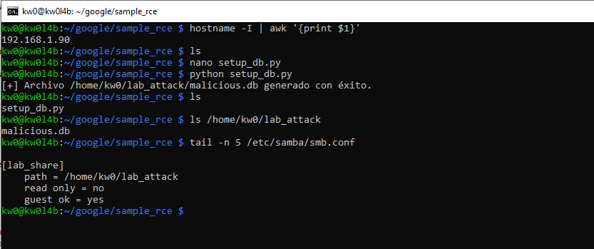
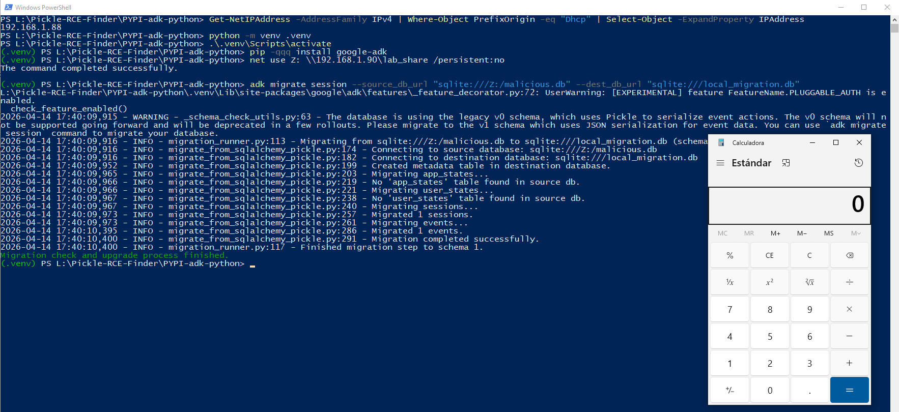

# `Agent Development Kit (ADK)` - Version `1.30.0` / Remote Code Execution (RCE) via Insecure Deserialization 

* https://pypi.org/project/google-adk/
* https://github.com/google/adk-python

## Introduction

**Usually, insecure deserialization vulnerabilities using `pickle` are related to the deserialization of a `.pkl` file (among others), which turns the vulnerability into a sort of out-of-scope "self-command-injection".**

**However, below are one (1) way to reproduce RCE in `Agent Development Kit (ADK)` using an `SMB` share controlled by an attacker, without local intervention by a third party to modify files that allow code execution during the deserialization process.**

**For this PoC, two (2) different devices were used to simulate the interaction between an attacking machine (Raspberry Pi with IP 192.168.1.90) and a victim machine (Windows with IP 192.168.1.88).**

## Vulnerability description

### The vulnerable code in `google/adk/sessions/migration/migrate_from_sqlalchemy_pickle.py`:

The `_row_to_event` function is used during the migration from legacy `v0` schemas. It extracts the `actions` column from the database and, if it is a `bytes` object (common in SQLite/MySQL), it calls `pickle.loads()` without any validation of the source's trustworthiness.

```python
54: def _row_to_event(row: dict) -> Event:
...
57:   actions_val = row.get("actions")
...
61:       if isinstance(actions_val, bytes):
62:         actions = pickle.loads(actions_val)
```

## Technical Impact Analysis

### Project Purpose & Context

`google-adk` (Agent Development Kit) is a framework designed to accelerate the development of agentic AI workflows. It provides high-level abstractions for managing long-running agent sessions, persistent event logging, and state synchronization across multiple platforms. It is widely used by developers to orchestrate interactions between Large Language Models (LLMs) and external tools, making it a critical hub for both data and execution control in modern AI applications.

### Platform & Deployment Environment

The ADK is typically deployed in:
*   **Developer Workstations**: For prototyping and local testing of AI agents.
*   **AI Backend Services**: Integrated into Vertex AI or custom cloud deployments to manage agent states.
*   **Automation Pipelines**: Running as part of CI/CD or MLOps workflows to validate agent behavior during migration or retraining phases.

### Comprehensive Risk Assessment

The identified vulnerabilities are rated as **CRITICAL**. By leveraging remote database URIs and shared state poisoning, attackers can systematically bypass the "self-command-injection" boundary. 
*   **Vector #1 (Migration)**: Allows an attacker to pivot from a malicious remote data source (e.g., an attacker-controlled SQLite file served via SMB) to full RCE on the device performing the migration.
*   **Vector #2 (Shared State)**: Enables lateral movement and persistent compromise within infrastructure where multiple agents share the same backend database (Spanner/MySQL). Any authenticated read of the "poisoned" events will trigger the exploit.

## Attack Scenario

### Who wants to exploit a particular vulnerability?

Adversaries targeting AI development infrastructure, including corporate spies seeking to exfiltrate proprietary agent logic/prompts, or actors looking to hijack developer credentials (AWS/GCP/SSH keys) stored on the same workstations.

### For what gain?

The primary gain is **Zero-Interaction RCE** on high-value targets (AI developers). Secondary gains include lateral movement into cloud environments where the agents are deployed and long-term persistence within the organization's AI lifecycle management.

### In what way?

The attack is orchestrated by exploiting the **trust in remote data sources**:
1.  **Malicious Migration Guides**: Tricking a developer into "migrating" from a demonstration or "publicly available" legacy database hosted on an attacker-controlled SMB share or cloud-hosted DB.
2.  **Shared Database Poisoning**: Injecting malicious pickles into shared Spanner/MySQL instances through low-privileged components, which later execute in the context of high-privileged administrative tools or UI servers.


# Reproduction steps

## On the Raspberry (attacker)

```bash
kw0@kw0l4b:~ $ hostname -I | awk '{print $1}'
192.168.1.90
kw0@kw0l4b:~ $
```

### Shared Resource Configuration (SMB):

1. **Install Samba**: `sudo apt update && sudo apt install samba samba-common-bin -y`
2. **Prepare the attack directory**:

```bash
mkdir ~/lab_attack
chmod 755 /home/kw0  # Allows Samba to access the HOME
chmod -R 777 ~/lab_attack
```

3. **Configure Samba**: Add to the end of `/etc/samba/smb.conf`:

```ini
[lab_share]
    path = /home/kw0/lab_attack
    read only = no
    guest ok = yes
```

1. **Payload Generation on the Raspberry**:

Run the specialized `setup_db.py` script to generate the `malicious.db` file directly in the shared path:

```bash
python setup_db.py
```



## On Windows (victim)

```powershell
PS L:\Pickle-RCE-Finder\PYPI-adk-python> Get-NetIPAddress -AddressFamily IPv4 | Where-Object PrefixOrigin -eq "Dhcp" | Select-Object -ExpandProperty IPAddress
192.168.1.88
PS L:\Pickle-RCE-Finder\PYPI-adk-python>
```

## Technical Requirements

*   Create a Python enviromnet
    *   `python -m venv .venv`
*   Active de the .venv
    *   `.venv\Scripts\activate`

```bash
pip install google-adk
```

### Exploit Execution:

```powershell
net use Z: \\192.168.1.90\lab_share /persistent:no
```

1. **Launch deserialization**:

```bash
adk migrate session --source_db_url "sqlite:///Z:/malicious.db" --dest_db_url "sqlite:///local_migration.db"
```



# Other RCE vectors in `Agent Development Kit (ADK)` remotely controlled by an attacker

## Persistent RCE via Shared State Poisoning (SQLAlchemy)

### Technical Detail

- **Component/File**: `google/adk/sessions/schemas/v0.py`
- **Method/Function**: `DynamicPickleType.process_result_value()`
- **Sink/Primitive**: `pickle.loads(value)`
- **Control Point**: The `actions` column in the `events` database table (MySQL/Spanner dialects).

### Analysis & Impact

In versions of ADK using the `v0` schema, the `actions` data is stored as a pickled object in MySQL or Spanner. SQLAlchemy automatically unpickles this data upon every read operation thanks to the `TypeDecorator` implementation.

**Reversing the Context**: This is a **Lateral Movement** vector. If an attacker can achieve a standard SQL injection in any application using this schema, or gain partial unauthorized access to a shared Spanner instance, they can "poison" the state. Any backend component (e.g., a high-privileged worker, an analytics tool, or another user's session) that later reads this event will execute the payload.

> [!WARNING]
> This turns a "Data Integrity" issue into a "Total System Takeover". Shared databases become an RCE transmission vector within the infrastructure.

### Exploit Scenario

1. **Setup**: Attacker identifies a component with low-privileged SQL write permission (e.g., a logging agent or a compromised sidecar).
2. **Trigger**: Attacker updates an existing record in the `actions` column with a malicious pickle blob.
3. **Impact**: An administrator with higher privileges opens the "ADK Web UI" to review sessions. The web server calls `session_service.list_sessions()`, loads the events, and triggers `pickle.loads()`.
4. **Result**: The web server is compromised, allowing the attacker to steal all session tokens or access sensitive API keys used by the UI.

### Systemic Impact & Infrastructure Risk

### Technical Detail (Code)

In `google/adk/sessions/schemas/v0.py`, the `DynamicPickleType` handles automatic deserialization when reading from MySQL or Spanner:

```python
113:   def process_result_value(self, value, dialect):
114:     """Ensures the raw bytes from the database are unpickled back into a Python object."""
115:     if value is not None:
116:       if dialect.name in ("spanner+spanner", "mysql"):
117:         return pickle.loads(value)
```

- **Persistence**: The exploit remains in the DB and triggers on every read, making it extremely difficult to clear without full DB purging.
- **Privilege Escalation**: Moves from a DB-access context to a Full-Account-Takeover context on the host running the SDK.
