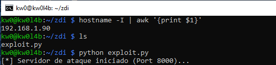
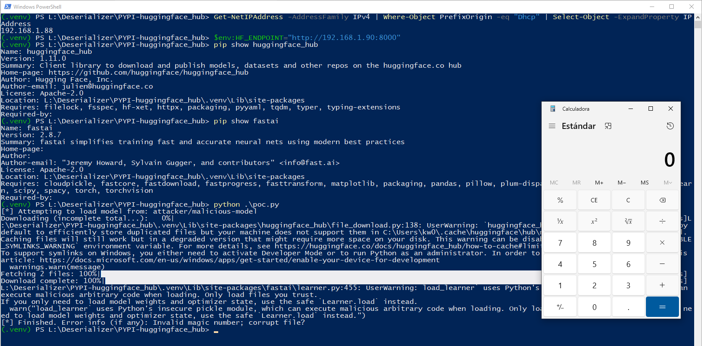
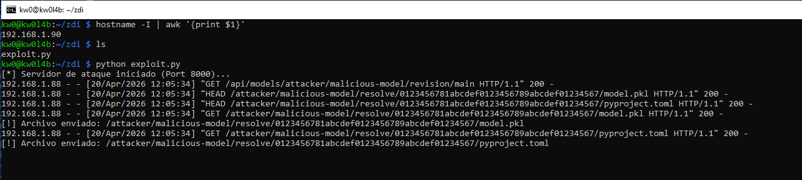

# `huggingface_hub` - Version `1.11.0` / Remote Code Execution (RCE) via Insecure Deserialization (Hub-to-RCE via `from_pretrained_fastai`)

* https://pypi.org/project/huggingface-hub/
* https://github.com/huggingface/huggingface_hub

## Introduction

> [!WARNING]
> This vulnerability requires the victim to interact with an external URL/API controlled by an attacker. While the most realistic exploitation scenario involves hosting a malicious payload in a public Hugging Face repository, creating such a resource poses a significant risk to the community, as innocent users could inadvertently download and execute the malicious model. To demonstrate the impact with technical fidelity without endangering third parties, this report utilizes a **simulated Hugging Face repository** hosted on a local mock server.

**Below are one (1) way to reproduce RCE in `huggingface_hub` using a simulated Hugging Face repository controlled by an attacker, without local intervention by a third party to modify files that allow code execution during the deserialization process.**

**For this PoC, two (2) different devices were used to simulate the interaction between an attacking machine (Raspberry Pi with IP 192.168.1.90) and a victim machine (Windows with IP 192.168.1.88).**

## Vulnerability description

The `huggingface_hub` package provides a utility module, `fastai_utils.py`, designed to simplify the integration between the Hugging Face Hub and the FastAI framework. The function `from_pretrained_fastai()` is designed to download a model repository snapshot and then load the primary learner object. Because FastAI's native loading mechanism (`load_learner`) relies on Python's insecure `pickle` module and `from_pretrained_fastai()` automatically points to a remote `model.pkl` file fetched from the network, it creates a direct Remote Code Execution (RCE) pipeline. On Windows systems, this vulnerability is amplified by the library's support for custom endpoints, allowing for **Infrastructure-Mediated RCE** where an attacker mocks the Hub API to deliver malicious weights.

### The vulnerable code in `huggingface_hub/fastai_utils.py`:

```python
def from_pretrained_fastai(repo_id: str, revision: str | None = None):
    # ... downloading snapshot ...
    storage_folder = snapshot_download(
        repo_id=repo_id,
        revision=revision,
        library_name="fastai",
        library_version=get_fastai_version(),
    )
    # ...
    from fastai.learner import load_learner  # type: ignore
    return load_learner(os.path.join(storage_folder, "model.pkl")) # <--- CRITICAL SINK
```

## Technical Impact Analysis

### Project Purpose & Context

Hugging Face Hub is the central infrastructure for modern Machine Learning, hosting hundreds of thousands of models. The `huggingface_hub` client is the primary gateway for developers and AI-as-a-Service (AIaaS) platforms to consume these models. By automating the download-and-load cycle, the library aims to improve developer velocity but inadvertently creates a supply chain risk where "data" (model weights) can execute arbitrary "code" (malicious pickles).

### Platform & Deployment Environment

This vulnerability impacts any environment using the FastAI integration, particularly **Data Science workstations** and **Automated ML Training Pipelines**. Windows environments are especially susceptible to endpoint redirection attacks where local environment variables (`HF_ENDPOINT`) or UNC/SMB paths can be used to hijack the model supply chain.

### Comprehensive Risk Assessment

The risk is categorized as **CRITICAL**. An attacker can achieve Remote Code Execution (RCE) by simply manipulating a user into loading a specific repository ID (e.g., `attacker/exploit-model`) from the Hub or a mocked endpoint. This bypasses the traditional "self-command-injection" boundary because the library is *intended* to pull and execute content from remote sources. Once a malicious model is cached, it provides a persistent backdoor that re-triggers RCE every time the model is initialized.


## Attack Scenario


### Who wants to exploit a particular vulnerability?

Adversaries targeting AI supply chains, corporate research environments, or ML engineers. This can include state-sponsored actors seeking industrial secrets or malicious actors looking to hijack expensive GPU infrastructure for crypto-mining or lateral movement.

### For what gain?

Gain full administrative access to the victim's environment, steal Hugging Face authentication tokens (often stored in plain text in the cache directory), and achieve persistence within high-compute clusters.

### In what way?

By publishing a malicious model to the public Hugging Face Hub under a deceptive name (typosquatting or social engineering) or by exploiting network-level redirections in shared environments to point the `HF_ENDPOINT` to an attacker-controlled mock API that serves the malicious pickle.


# Reproduction steps

## On the Raspberry (attacker) - IP 192.168.1.90

```bash
kw0@kw0l4b:~ $ hostname -I | awk '{print $1}'
192.168.1.90
kw0@kw0l4b:~ $
```

### Activate the simulated Hugging Face repository and serve the malicious model

```bash
python exploit.py
```



## On Windows (victim) - IP 192.168.1.88

```
(.venv) PS L:\Deserializer\PYPI-huggingface_hub> Get-NetIPAddress -AddressFamily IPv4 | Where-Object PrefixOrigin -eq "Dhcp" | Select-Object -ExpandProperty IPAddress
192.168.1.88
(.venv) PS L:\Deserializer\PYPI-huggingface_hub>
```

1. Create a `.venv`, activate it, and install the latest updated version (`1.11.0`) of `huggingface_hub` using `pip install huggingface-hub`. 
2. Additionally, it is necessary to install `fastai`, `toml` and `ipython` to create a complete testing environment: `pip install fastai toml ipython`.
3. Set the variable environment `$env:HF_ENDPOINT="http://192.168.1.90:8000"` to point the simulated Hugging Face repository
4. And then lauch `poc.py` to trigger the RCE from the victim machine:


