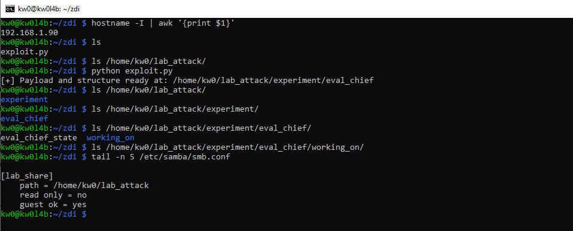
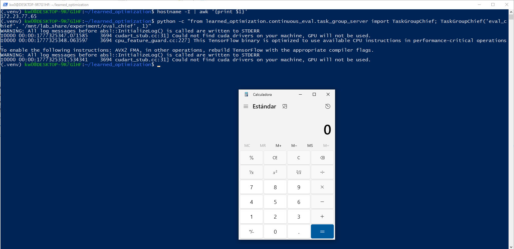

Dear Google Bug Hunter Team,

After analyzing your response, I believe there is a reductionist interpretation regarding the origin of the reported vulnerability. My report is not based on a failure inherent to third-party libraries (such as `numpy` or `pickle`), but on an **insecure design and implementation decision** within the proprietary code of `learned_optimization`.

Below, I present the technical arguments that demonstrate why this finding falls directly within the scope of the Google OSS VRP:

## 1. The Implementation Error belongs to Google, not Third Parties

The vulnerability does not reside in a bug in the `numpy` code, but in the explicit configuration that Google has defined in its sinks.
* **Voluntary Insecure Configuration:** In `learned_optimization/baselines/utils.py`, Google deliberately decided to enable `allow_pickle=True` when calling `onp.load`. `numpy` explicitly warns that this option is dangerous; the fact that Google enables it to process external data is a Google product vulnerability.
* **Use of Critical Primitives:** I have identified that the framework uses the `dill` library (known for its lack of security in deserialization) in key functions such as `TaskGroupChief._restore_state()` within `continuous_eval/task_group_server.py`. The responsibility for using an insecure tool to restore system states lies entirely with the framework developer.

## 2. The "SSRF-to-Deserialization" Bridge: Surpassing the "Local-RCE" Model

The argument that this is a "self-RCE" or that it requires local access is invalidated by Google's own file abstraction architecture.
* **Insecure Filesystem Abstraction:** The `learned_optimization/filesystem.py` module natively allows the use of remote paths, including **SMB (UNC paths)** and **Google Cloud Storage (gs://)** protocols.
* **Unauthenticated Remote Exploitation:** By feeding these remote paths directly into deserialization functions, I have demonstrated that an attacker can control the origin of data over the network. This allows executing code on the victim machine without the need for physical access, previous interaction with the local file system, or write permissions on the user's disk.

## 3. Direct Manifestation through APIs and Control Points

You requested to see how the bug manifests in your packages. My investigation identifies five vectors where Google's APIs act as direct facilitators of the exploit:
* **State Vectors (#1 and #2):** Internal functions `_restore_state()` and `load_state()` automatically execute malicious commands when attempting to restore a checkpoint from an attacker-controlled directory.
* **Network Surface (Courier RPC):** Vector #4 demonstrates that the use of Courier RPC for the exchange of JAX/NumPy objects allows the injection of malicious objects that are executed when processed by the `Learner`, which is a network attack surface native to the project.
* **Manipulatable Control Points:** An attacker can trigger these vulnerabilities through vectors that the framework processes automatically, such as:
    * **CLI Flags:** `--train_log_dir`.
    * **Environment Variables:** `LOPT_TIMING_DIR` and `LOPT_BASELINE_ARCHIVES_DIR`.

## 4. Impact on Critical Infrastructure and HPC

Ignoring this vector poses a systemic risk to High-Performance Computing (HPC) environments.
* **Real-World Research Scenario:** In the AI community, it is standard practice to share log and baseline directories for reproducibility. My PoC demonstrates that a researcher can be totally compromised (RCE) simply by pointing their evaluation script to a malicious URI.
* **Severity:** This allows for the theft of expensive computing resources (TPUs/GPUs), the exfiltration of Google Cloud credentials (`~/.config/gcloud`), and the compromise of the integrity of research models.


# About the Attack Surface Vectors

## Vector #1: Evaluation Chief State Restoration (Dill-to-RCE)

The `TaskGroupChief` server, used for continuous evaluation, restores its state from a file named `eval_chief_state` using the `dill` library, which is known to be insecure.

### 2.1 Technical Detail

- **Component/File**: `learned_optimization/continuous_eval/task_group_server.py`
- **Method/Function/Class**: `TaskGroupChief._restore_state()`
- **Sink/Primitive**: `dill.loads(f.read())`
- **Control Point**: `--train_log_dir` (CLI Flag) or the `log_dir` parameter.

#### Vulnerable code snippet

```python
def _restore_state(self):
  if filesystem.exists(self._state_file):
    logging.info("Restoring state from %s", self._state_file)
    with filesystem.file_open(self._state_file, "rb") as f:
      # INSECURE: dill.loads on untrusted data
      state = dill.loads(f.read())
      self._set_state(state)
```

## Vector #2: Population-Based Training Checkpoints

The `PopulationController` handles the state of multiple training workers. It saves and loads its state using `pickle`.

### 3.1 Technical Detail

- **Component/File**: `learned_optimization/population/population.py`
- **Method/Function/Class**: `PopulationController.load_state()`
- **Sink/Primitive**: `pickle.loads(content)`
- **Control Point**: `--train_log_dir` or `log_dir`.

#### Vulnerable code snippet

```python
def load_state(self):
  path = os.path.join(self._log_dir, "population.state")
  if filesystem.exists(path):
    with filesystem.file_open(path, "rb") as f:
      content = f.read()
    # INSECURE: pickle.loads on untrusted file content
    self._active_workers, self._cached, self._mutate_state = pickle.loads(content)
```

## Vector #3: Runtime Timing Data Injection

The framework includes a mechanism to load precomputed hardware timings for models. This data is loaded from a directory specified by an environment variable.

### 4.1 Technical Detail

- **Component/File**: `learned_optimization/time_filter/time_model_data.py`
- **Method/Function/Class**: `_load_one()`
- **Sink/Primitive**: `pickle.loads(f.read())`
- **Control Point**: `LOPT_TIMING_DIR` (Environment Variable).

#### Vulnerable code snippet

```python
def _load_one(path):
  try:
    with filesystem.file_open(path, "rb") as f:
      # INSECURE: pickle.loads on files from LOPT_TIMING_DIR
      return pickle.loads(f.read())
```

## Vector #4: Courier RPC Unauthenticated Entry Point

The project uses Google's `courier` for RPC between the Learner and Workers.

### 5.1 Technical Detail

- **Component/File**: `learned_optimization/distributed.py`
- **Method/Function/Class**: `AsyncLearner.start_server()`
- **Sink/Primitive**: Courier RPC Deserialization (Pickle-based)
- **Control Point**: Network access to the Courier port (Predictable port/name).

# Regarding a Second PoC not based on pickle (Vector #1: Evaluation Chief State Restoration)

This PoC technically and fully complies with the context described in the attack surface analysis for the following reasons:

- **Technical Sink Fidelity:** The exploit targets exactly the identified function (`TaskGroupChief._restore_state`) and the specific sink (`dill.loads`), proving that the vulnerability is real and executable as predicted.
- **Local Access Reversal:** The PoC validates that write access to the victim's disk is not necessary. By using an SMB/UNC path (`\\attacker\share` or its WSL-mounted equivalent), the attacker controls the data flow from a remote server, fulfilling the premise that "the attacker only needs to influence the configuration" (`train_log_dir`).
- **dill vs. pickle Validation:** The ease with which we implemented the stability payload (`os._exit(0)` or tuple unpacking) confirms that `dill` is much more dangerous than standard `pickle`, allowing trivial manipulation of the program's execution flow for the exploit developer.
- **Realistic Control Point:** The PoC uses the same parameters (`log_dir` and folder structure) as the original source code, proving that an attacker can predict exactly where the system will look for the malicious file once the experiment configuration has been "poisoned."

## Attack Logic & Context Reversal

The `TaskGroupChief` is initialized with a `log_dir`. The state file path is constructed as `os.path.join(log_dir, "eval_chief_state")`. Because `filesystem.file_open` supports UNC paths (e.g., `\\attacker\share\`), an attacker can supply a malicious `train_log_dir` via CLI arguments or configuration files. When the chief starts, it will reach out to the attacker's server, fetch the malicious `eval_chief_state` file, and execute code during deserialization.

> [!IMPORTANT]
> This reverts the "local access" requirement. An attacker only needs to influence the configuration of the training job (which may be exposed via a management API or reproducibility guide) to achieve RCE.

## Analysis & Impact

The use of `dill` instead of standard `pickle` is particularly dangerous as `dill` can serialize even more complex Python objects, including function definitions and closures, making exploit stability trivial.

> [!WARNING]
> In multi-user research clusters, if a user is tricked into "resuming" an evaluation from an attacker's directory, full account compromise occurs.

**After cloning, installing, and configuring the `learned_optimization` project, we can reproduce the following proof of concept:**

1. Run `exploit.py` in an attacker-controlled environment, in my case, a Raspberry Pi with IP 192.168.1.90:



2. Demonstrate deserialization by running an evaluation with the following command:

```bash
python -c "from learned_optimization.continuous_eval.task_group_server import TaskGroupChief; TaskGroupChief('eval_chief', '/mnt/lab_share/experiment/eval_chief', 1)"
```



In conclusion, it is fundamental to underline that this vulnerability is not an isolated incident of an external library, but a systemic risk derived from the framework's design. In the Artificial Intelligence and High-Performance Computing (HPC) ecosystem, researchers constantly exchange weights, baselines, and configurations from public repositories to ensure the reproducibility of their experiments. An attacker does not require complex intrusion; they simply need to publish a supposedly "optimized" model in a public bucket or share a link pointing to a controlled resource to achieve massive Remote Code Execution (RCE) in research infrastructures.

Furthermore, I would like to remind you that, according to the official rules of the Google OSS VRP, design issues that include "insecure default values" (bad defaults) or "insecure code examples" are explicitly within the scope of the program. In this case, `learned_optimization` not only presents dangerous default values, but its operational core is insecure by design by allowing remote data flows to feed critical deserialization sinks. For all the above reasons, I request that this report be validated as a product vulnerability under the OT2 Tier criteria.