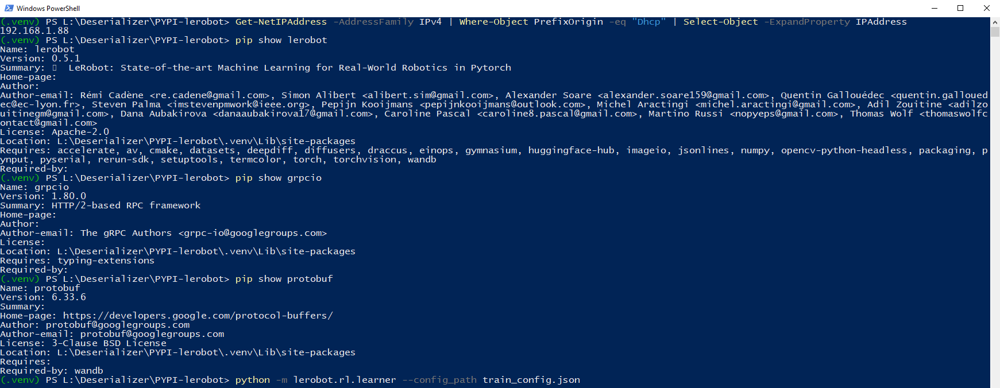
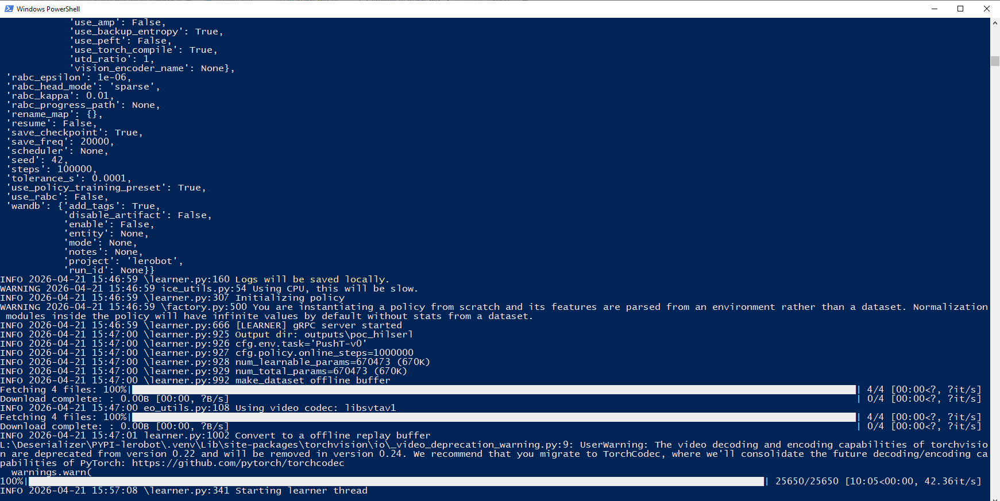
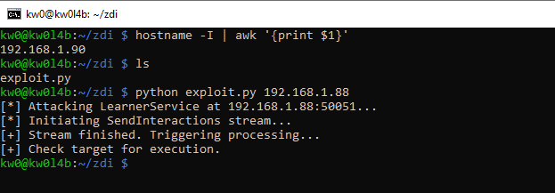
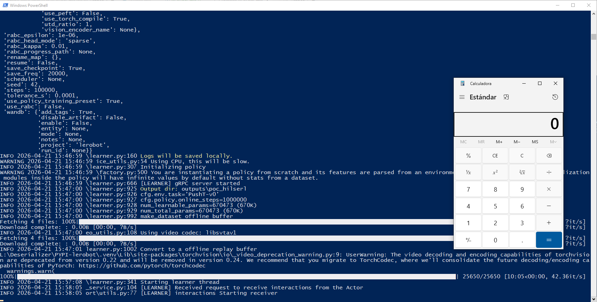

# `LeRobot` - Version `0.5.1` / Remote Code Execution (RCE) via Insecure Deserialization based on sink `pickle.loads` and gRPC `SendInteractions` stream data in `LearnerService`

* https://pypi.org/project/lerobot/
* https://github.com/huggingface/lerobot

## Introduction

**Below are one (1) way to reproduce RCE in `LeRobot` using a remote exploit controlled by an attacker (via web), without local intervention by a third party to modify files that allow code execution during the deserialization process.**

**For this PoC, two (2) different devices were used to simulate the interaction between an attacking machine (Raspberry Pi with IP 192.168.1.90) and a victim machine (Windows with IP 192.168.1.88).**

## Vulnerability description

The `LearnerService` in LeRobot v0.5.1 is part of the distributed HILSerl (Human-In-The-Loop Soft Actor-Critic) training architecture. It enables remote "Actors" (robot clients) to send episodic interaction data to a central "Learner" (server) for processing and model updates.

This service is exposed via gRPC on port 50051 by default and is completely unauthenticated. The `SendInteractions` method accepts a stream of data that is reassembled and then passed to an insecure `pickle.load` sink (`bytes_to_python_object`). An attacker can spoof an Actor instance and send a malicious serialized object, achieving Remote Code Execution (RCE) on the central training server.


### The vulnerable code in `lerobot/transport/utils.py` (Sink):

```python
132: def bytes_to_python_object(buffer: bytes) -> Any:
133:     bytes_buffer = io.BytesIO(buffer)
134:     bytes_buffer.seek(0)
135:     obj = pickle.load(bytes_buffer)  # nosec B301: Safe usage of pickle.load
136:     # Add validation checks here
137:     return obj
```

### The vulnerable code in `lerobot/rl/learner.py` (Caller):

```python
1111: def process_interaction_message(
1112:     message, interaction_step_shift: int, wandb_logger: WandBLogger | None = None
1113: ):
1114:     """Process a single interaction message with consistent handling."""
1115:     message = bytes_to_python_object(message)
```

## Technical Impact Analysis

### Project Purpose & Context

In distributed reinforcement learning, the Learner is the most critical infrastructure component, as it aggregates experience from multiple robots to update the global policy. The `LearnerService` facilitates this high-bandwidth data exchange, making it a natural but insecure entry point when deployed over network boundaries.


### Platform & Deployment Environment

Typically deployed on high-performance Linux or Windows servers equipped with high-end GPUs. These servers are often exposed to a local research network where multiple robot clients (Actors) connect to stream training data during long-running experiments.


### Comprehensive Risk Assessment

The risk is **Critical**. Compromise of the Learner allows an attacker to manipulate the learning process of multiple physical robots simultaneously. Additionally, the Learner environment often contains high-value assets such as proprietary reward functions, environment simulators, and cloud API keys (Hugging Face / WandB) stored for metrics logging and model checkpoints.


## Attack Scenario


### Who wants to exploit a particular vulnerability?

Adversaries targeting high-tech robotics firms, academic institutions conducting sensitive autonomous systems research, or any entity looking to compromise GPU-heavy infrastructure for lateral movement.


### For what gain?

Intellectual property theft (policy architectures, trained weights), infrastructure hijacking (GPU compute resources), and the ability to inject backdoors into the learned behaviors of autonomous agents.


### In what way?

By establishing a gRPC stream connection to the `LearnerService` (port 50051) and calling `SendInteractions`. The attacker sends a stream of bytes that, when reassembled by the victim, forms a malicious `pickle` object. The RCE is triggered as soon as the Learner's main loop processes the next message from its internal queue.


## Reproduction steps

## On Windows (victim) - IP 192.168.1.88

```
(.venv) PS L:\Deserializer\PYPI-lerobot> Get-NetIPAddress -AddressFamily IPv4 | Where-Object PrefixOrigin -eq "Dhcp" | Select-Object -ExpandProperty IPAddress
192.168.1.88
(.venv) PS L:\Deserializer\PYPI-lerobot>
```

1. Create a `.venv`, activate it, and install the latest updated version (`0.5.1`) of `LeRobot` using `pip install lerobot`. 
2. Additionally, it is necessary to install `grpcio` and `protobuf` to create a complete testing environment: `pip install grpcio protobuf`.
3. And then launch the Learner Service:

```
python -m lerobot.rl.learner --config_path train_config.json
```




## On the Raspberry (attacker) - IP 192.168.1.90

```bash
kw0@kw0l4b:~ $ hostname -I | awk '{print $1}'
192.168.1.90
kw0@kw0l4b:~ $
```

### Run the exploit to trigger the RCE:

```bash
python exploit.py 192.168.1.88
```



And in the Windows victim machine:

