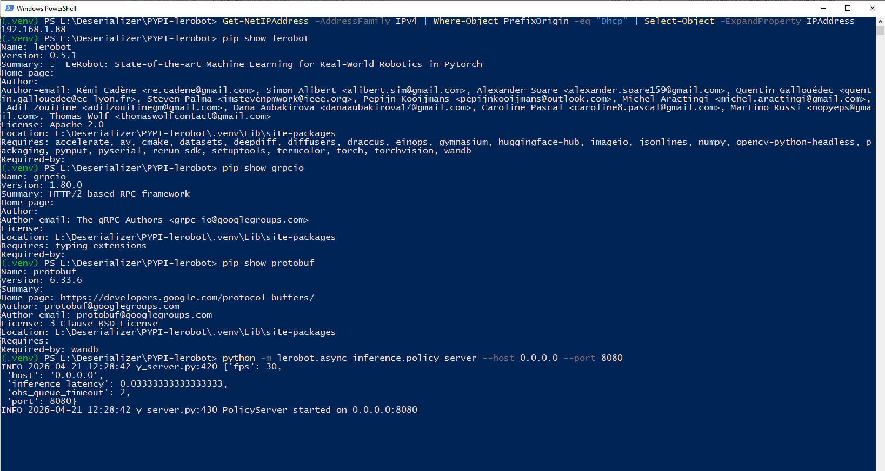
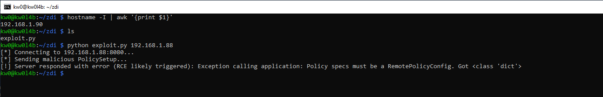
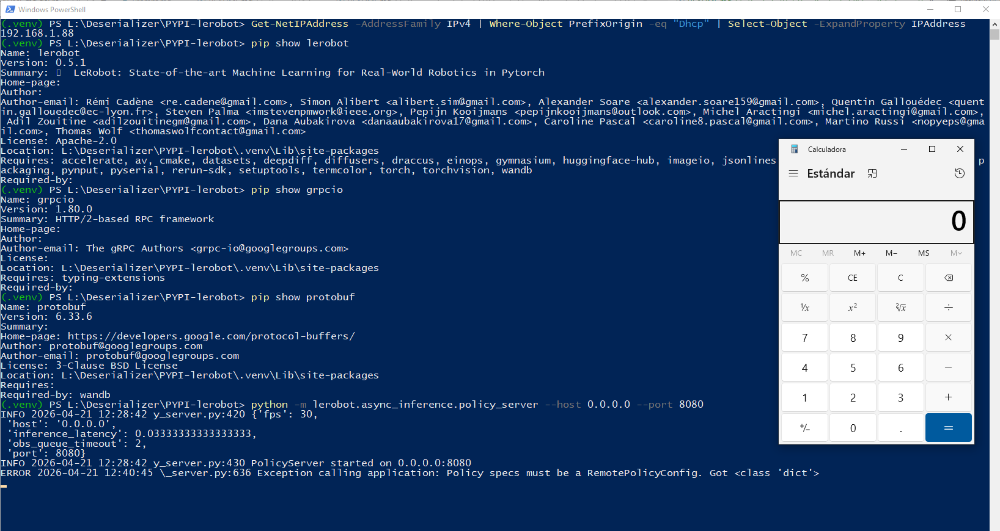

# `LeRobot` - Version `0.5.1` / Remote Code Execution (RCE) via Insecure Deserialization based on sink `pickle.loads` and `request.data` point in `PolicyServer` 

* https://pypi.org/project/lerobot/
* https://github.com/huggingface/lerobot

## Introduction

**Below are one (1) way to reproduce RCE in `LeRobot` using a remote exploit controlled by an attacker (via web), without local intervention by a third party to modify files that allow code execution during the deserialization process.**

**For this PoC, two (2) different devices were used to simulate the interaction between an attacking machine (Raspberry Pi with IP 192.168.1.90) and a victim machine (Windows with IP 192.168.1.88).**

## Vulnerability description

The `PolicyServer` in LeRobot v0.5.1 is an unauthenticated gRPC service used for remote robot policy inference. The server implements two critical entry points, `SendPolicyInstructions` and `SendObservations`, both of which process incoming byte streams using the insecure `pickle.loads` function. 

Because the gRPC service is unauthenticated and uses `add_insecure_port`, any network-adjacent attacker can send a serialized malicious Python object. Upon reconstruction, this object can execute arbitrary commands in the context of the server process. This bypasses the typical "self-command-injection" restriction of pickle vulnerabilities as it enables remote execution without requiring local file system access.


### The vulnerable code in `lerobot/async_inference/policy_server.py`:

```python
106:     def SendPolicyInstructions(self, request: services_pb2.PolicySetup, context: grpc.ServicerContext):
107:         # TODO: authorize the request
...
125:         policy_specs = pickle.loads(request.data)  # nosec
```

## Technical Impact Analysis

### Project Purpose & Context

LeRobot is a framework developed by Hugging Face for robotics research, enabling the training and deployment of policies for various robot hardware. It is designed for high-performance inference, often separating the heavy computation (GPU-based Policy Server) from the physical robot client (Edge device), making the network-based communication protocol a critical security boundary.


### Platform & Deployment Environment

The framework is cross-platform (Linux/Windows) and typically deployed in robotic research labs, universities, and industrial prototyping environments. Instances often run on local networks or specialized robot-to-server WLANs where gRPC services are exposed to facilitate real-time control.


### Comprehensive Risk Assessment

The risk is classified as **Critical**. The ability to execute remote code on the inference server allows for the theft of proprietary models, poisoning of training data, and potential lateral movement into high-value research infrastructure (e.g., Hugging Face Hub accounts, Weights & Biases projects). Furthermore, in a connected robotics environment, an attacker could potentially manipulate the physical behavior of a robot by compromising the server that dictates its actions.


## Attack Scenario


### Who wants to exploit a particular vulnerability?

Threat actors interested in industrial espionage, competitors seeking model weights/architectures, or individuals aiming to disrupt or sabotage robotic research operations.


### For what gain?

High-fidelity access to model weights, exfiltration of sensitive training datasets, or the ability to implement persistent backdoors within autonomous robotic systems.


### In what way?

By sending a single, malformed gRPC request to the `PolicyServer` port (default 8080). This request contains a `pickle` payload that executes an OS command (e.g., opening a reverse shell or exfiltrating environment variables) the moment the server attempts to "setup" the policy or "receive" an observation.


## Reproduction steps

## On Windows (victim) - IP 192.168.1.88

```
(.venv) PS L:\Deserializer\PYPI-lerobot> Get-NetIPAddress -AddressFamily IPv4 | Where-Object PrefixOrigin -eq "Dhcp" | Select-Object -ExpandProperty IPAddress
192.168.1.88
(.venv) PS L:\Deserializer\PYPI-lerobot>
```

1. Create a `.venv`, activate it, and install the latest updated version (`0.5.1`) of `LeRobot` using `pip install lerobot`. 
2. Additionally, it is necessary to install `grpcio` and `protobuf` to create a complete testing environment: `pip install grpcio protobuf`.
3. And then lauch the Policy Server:

```
python -m lerobot.async_inference.policy_server --host 0.0.0.0 --port 8080
```



## On the Raspberry (attacker) - IP 192.168.1.90

```bash
kw0@kw0l4b:~ $ hostname -I | awk '{print $1}'
192.168.1.90
kw0@kw0l4b:~ $
```

### Run the exploit to trigger the RCE:

```bash
python exploit.py 192.168.1.88
```



And in the Windows victim machine:

